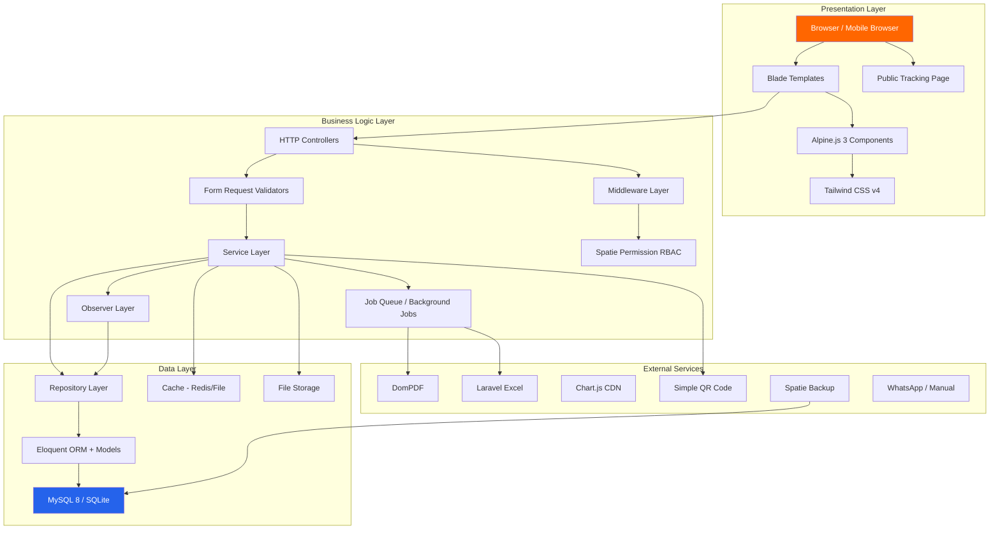
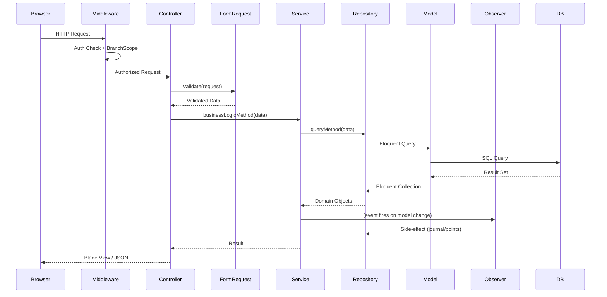
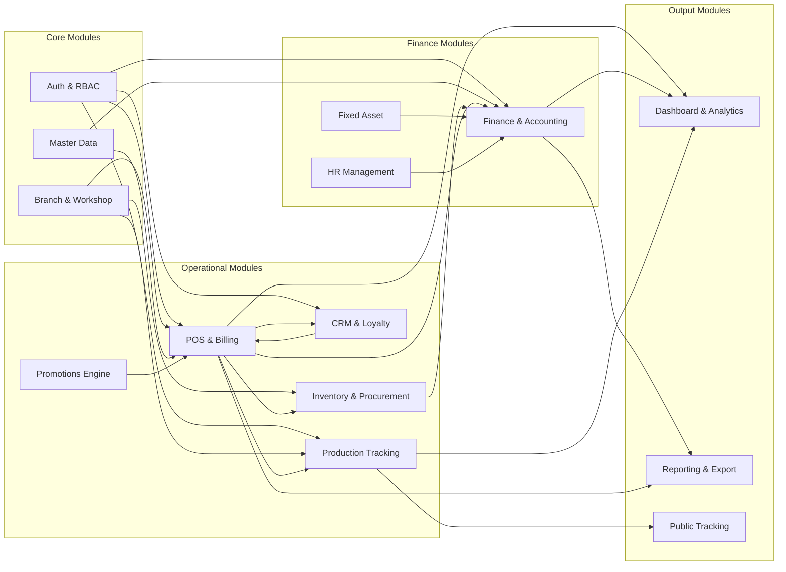
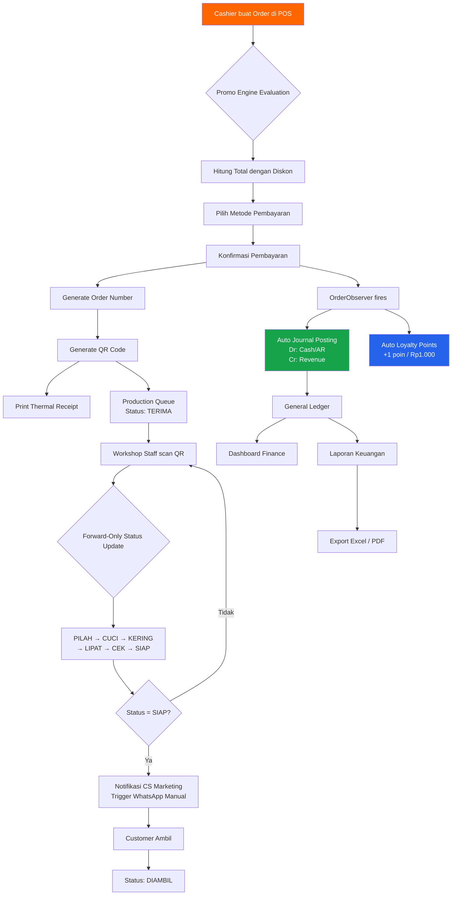
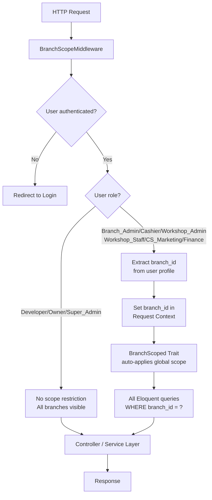
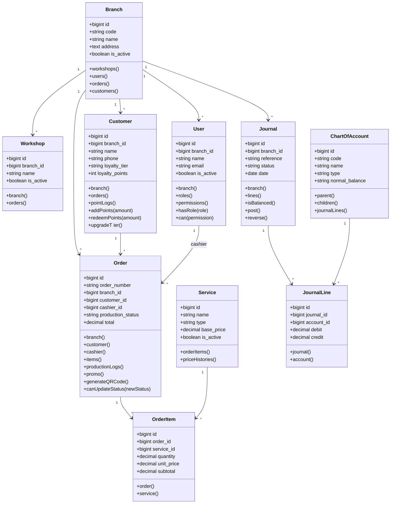
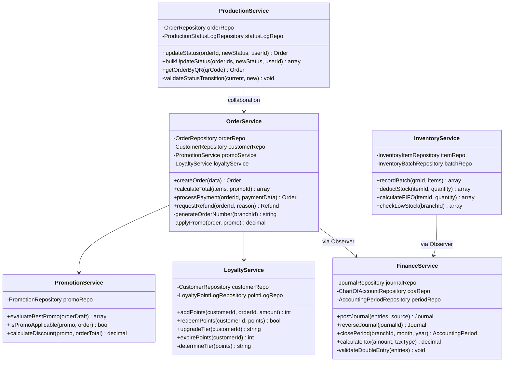
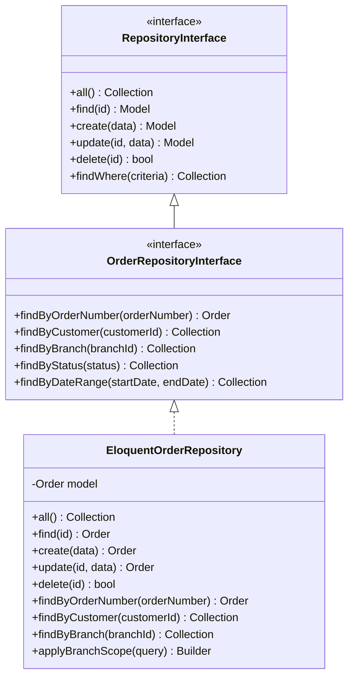

# Design Document — Istana Laundry Management System

## Overview

Istana Laundry Management System adalah platform Semi-ERP berbasis web yang mengelola operasional bisnis laundry multi-cabang secara terintegrasi. Sistem ini dirancang menggunakan arsitektur 3-layer (Presentation, Business Logic, Data Layer) dengan implementasi Repository Pattern, Service Layer Pattern, dan Observer Pattern untuk memastikan separasi concerns yang bersih, maintainability tinggi, dan skalabilitas hingga 10+ cabang.

Sistem dibangun dengan **Laravel 13 + PHP 8.5+**, menggunakan **Blade + Alpine.js 3** untuk UI interaktif, **Tailwind CSS v4** untuk styling, **MySQL 8** untuk production, dan **SQLite** untuk development. RBAC dikelola oleh **Spatie Permission v8**, dengan **Laravel Breeze** sebagai authentication foundation.

### Tech Stack Summary

| Layer | Technology |
|-------|-----------|
| Backend Framework | Laravel 13, PHP 8.5+ |
| Frontend Template | Blade Template Engine |
| Interactivity | Alpine.js 3 |
| Styling | Tailwind CSS v4 + @tailwindcss/vite |
| Database (Prod) | MySQL 8 |
| Database (Dev) | SQLite |
| Authentication | Laravel Breeze |
| Authorization | Spatie Permission v8 |
| Charts | Chart.js |
| Excel Export | Laravel Excel |
| PDF Generation | DomPDF |
| QR Code | Simple QR Code |
| Backup | Spatie Laravel Backup |

---

## Architecture

### System Architecture Diagram (3-Layer)



### Request Lifecycle



---

## Components and Interfaces

### Module Integration Flow



### Data Flow: POS → Production → Finance → Reporting



### Branch Scoping Strategy



---

## Data Models

### Database Schema ERD (Entity Relationship Diagram)

```mermaid
erDiagram
    BRANCHES {
        bigint id PK
        string code UK
        string name
        text address
        string phone
        decimal lat
        decimal lng
        boolean is_active
        timestamps
    }

    WORKSHOPS {
        bigint id PK
        bigint branch_id FK
        string name
        text address
        boolean is_active
        timestamps
    }

    USERS {
        bigint id PK
        string name
        string email UK
        string password
        bigint branch_id FK
        boolean is_active
        timestamp last_login_at
        timestamps
    }

    CUSTOMERS {
        bigint id PK
        bigint branch_id FK
        string name
        string phone UK
        string email
        text address
        string member_code UK
        string loyalty_tier
        int loyalty_points
        decimal total_spent
        int transaction_count
        timestamp last_transaction_at
        timestamps
    }

    SERVICES {
        bigint id PK
        string name
        string type
        string unit
        decimal base_price
        int est_duration_hours
        boolean is_active
        timestamps
    }

    SERVICE_BRANCH_PRICES {
        bigint id PK
        bigint service_id FK
        bigint branch_id FK
        decimal price
        boolean is_active
        timestamps
    }

    ORDERS {
        bigint id PK
        string order_number UK
        bigint branch_id FK
        bigint customer_id FK
        bigint cashier_id FK
        string status
        string payment_method
        string payment_status
        decimal subtotal
        decimal discount_amount
        decimal points_used
        decimal tax_amount
        decimal total
        decimal paid_amount
        decimal change_amount
        text notes
        string qr_code_path
        timestamp paid_at
        timestamps
    }

    ORDER_ITEMS {
        bigint id PK
        bigint order_id FK
        bigint service_id FK
        decimal quantity
        string unit
        decimal unit_price
        decimal discount
        decimal subtotal
        text notes
        timestamps
    }

    PRODUCTION_STATUSES {
        bigint id PK
        bigint order_id FK
        string status
        bigint updated_by FK
        text notes
        timestamp created_at
    }

    PROMOTIONS {
        bigint id PK
        bigint branch_id FK
        string name
        string type
        decimal value
        decimal min_transaction
        int usage_limit
        int usage_count
        int per_customer_limit
        date start_date
        date end_date
        boolean is_active
        timestamps
    }

    LOYALTY_POINT_LOGS {
        bigint id PK
        bigint customer_id FK
        bigint order_id FK
        int points
        string type
        text description
        timestamp expired_at
        timestamps
    }

    CHART_OF_ACCOUNTS {
        bigint id PK
        bigint parent_id FK
        string code UK
        string name
        string type
        string normal_balance
        boolean is_active
        boolean is_system
        timestamps
    }

    JOURNALS {
        bigint id PK
        bigint branch_id FK
        string reference
        string type
        string description
        date date
        string status
        bigint created_by FK
        timestamps
    }

    JOURNAL_LINES {
        bigint id PK
        bigint journal_id FK
        bigint account_id FK
        decimal debit
        decimal credit
        text description
        timestamps
    }

    INVENTORY_ITEMS {
        bigint id PK
        bigint branch_id FK
        string name
        string sku UK
        string unit
        decimal min_stock
        decimal current_stock
        timestamps
    }

    INVENTORY_BATCHES {
        bigint id PK
        bigint item_id FK
        bigint grn_id FK
        string batch_number
        decimal quantity
        decimal remaining_qty
        decimal unit_cost
        date received_date
        timestamps
    }

    PURCHASE_REQUESTS {
        bigint id PK
        bigint branch_id FK
        bigint requested_by FK
        string pr_number UK
        string status
        date request_date
        timestamps
    }

    PURCHASE_ORDERS {
        bigint id PK
        bigint pr_id FK
        bigint branch_id FK
        string po_number UK
        bigint supplier_id FK
        string status
        decimal total
        timestamps
    }

    GOODS_RECEIVED_NOTES {
        bigint id PK
        bigint po_id FK
        string grn_number UK
        string status
        date received_date
        timestamps
    }

    EMPLOYEES {
        bigint id PK
        bigint branch_id FK
        bigint user_id FK
        string nik UK
        string name
        string position
        decimal base_salary
        boolean is_active
        date joined_at
        timestamps
    }

    ATTENDANCES {
        bigint id PK
        bigint employee_id FK
        date date
        string status
        time check_in
        time check_out
        timestamps
    }

    PAYROLLS {
        bigint id PK
        bigint branch_id FK
        int month
        int year
        string status
        timestamps
    }

    PAYROLL_ITEMS {
        bigint id PK
        bigint payroll_id FK
        bigint employee_id FK
        decimal base_salary
        decimal allowance
        decimal deduction
        decimal net_salary
        timestamps
    }

    FIXED_ASSETS {
        bigint id PK
        bigint branch_id FK
        string asset_code UK
        string name
        string category
        date acquisition_date
        decimal acquisition_cost
        decimal salvage_value
        int useful_life_months
        string depreciation_method
        decimal accumulated_depreciation
        decimal book_value
        boolean is_active
        timestamps
    }

    DEPRECIATION_SCHEDULES {
        bigint id PK
        bigint asset_id FK
        date period_date
        decimal depreciation_amount
        decimal accumulated
        decimal book_value
        boolean is_posted
        timestamps
    }

    AUDIT_LOGS {
        bigint id PK
        bigint user_id FK
        string action
        string model_type
        bigint model_id
        json old_values
        json new_values
        string ip_address
        string user_agent
        timestamps
    }

    ACCOUNTING_PERIODS {
        bigint id PK
        bigint branch_id FK
        int month
        int year
        string status
        timestamp closed_at
        bigint closed_by FK
        timestamps
    }

    BRANCHES ||--o{ WORKSHOPS : "has"
    BRANCHES ||--o{ USERS : "belongs_to"
    BRANCHES ||--o{ CUSTOMERS : "has"
    BRANCHES ||--o{ ORDERS : "has"
    BRANCHES ||--o{ SERVICE_BRANCH_PRICES : "has"
    BRANCHES ||--o{ JOURNALS : "has"
    BRANCHES ||--o{ INVENTORY_ITEMS : "has"
    BRANCHES ||--o{ EMPLOYEES : "has"
    BRANCHES ||--o{ FIXED_ASSETS : "has"
    CUSTOMERS ||--o{ ORDERS : "places"
    CUSTOMERS ||--o{ LOYALTY_POINT_LOGS : "has"
    ORDERS ||--o{ ORDER_ITEMS : "contains"
    ORDERS ||--o{ PRODUCTION_STATUSES : "tracks"
    SERVICES ||--o{ ORDER_ITEMS : "included_in"
    SERVICES ||--o{ SERVICE_BRANCH_PRICES : "priced_by"
    JOURNALS ||--o{ JOURNAL_LINES : "has"
    CHART_OF_ACCOUNTS ||--o{ JOURNAL_LINES : "used_in"
    INVENTORY_ITEMS ||--o{ INVENTORY_BATCHES : "has"
    PURCHASE_REQUESTS ||--o{ PURCHASE_ORDERS : "generates"
    PURCHASE_ORDERS ||--o{ GOODS_RECEIVED_NOTES : "fulfilled_by"
    GOODS_RECEIVED_NOTES ||--o{ INVENTORY_BATCHES : "creates"
    EMPLOYEES ||--o{ ATTENDANCES : "has"
    PAYROLLS ||--o{ PAYROLL_ITEMS : "contains"
    EMPLOYEES ||--o{ PAYROLL_ITEMS : "receives"
    FIXED_ASSETS ||--o{ DEPRECIATION_SCHEDULES : "has"
    ACCOUNTING_PERIODS ||--o{ JOURNALS : "covers"
```

---

### Detailed Database Schema

#### Table: `branches`
| Column | Type | Constraint | Description |
|--------|------|-----------|-------------|
| id | BIGINT UNSIGNED | PK, AUTO_INCREMENT | |
| code | VARCHAR(10) | UNIQUE, NOT NULL | e.g. "JKT01" |
| name | VARCHAR(100) | NOT NULL | |
| address | TEXT | NOT NULL | |
| phone | VARCHAR(20) | | |
| email | VARCHAR(100) | | |
| lat | DECIMAL(10,8) | NULLABLE | GPS latitude |
| lng | DECIMAL(11,8) | NULLABLE | GPS longitude |
| is_active | BOOLEAN | DEFAULT TRUE | |
| created_at | TIMESTAMP | | |
| updated_at | TIMESTAMP | | |
| deleted_at | TIMESTAMP | NULLABLE | Soft delete |

**Indexes:** `idx_branches_code` (code), `idx_branches_is_active` (is_active)

#### Table: `workshops`
| Column | Type | Constraint | Description |
|--------|------|-----------|-------------|
| id | BIGINT UNSIGNED | PK | |
| branch_id | BIGINT UNSIGNED | FK → branches.id | |
| name | VARCHAR(100) | NOT NULL | |
| address | TEXT | NULLABLE | |
| is_active | BOOLEAN | DEFAULT TRUE | |
| created_at | TIMESTAMP | | |
| updated_at | TIMESTAMP | | |

#### Table: `users`
| Column | Type | Constraint | Description |
|--------|------|-----------|-------------|
| id | BIGINT UNSIGNED | PK | |
| branch_id | BIGINT UNSIGNED | FK → branches.id, NULLABLE | NULL = super-level user |
| name | VARCHAR(100) | NOT NULL | |
| email | VARCHAR(150) | UNIQUE, NOT NULL | |
| password | VARCHAR(255) | NOT NULL | bcrypt hash |
| is_active | BOOLEAN | DEFAULT TRUE | |
| remember_token | VARCHAR(100) | NULLABLE | |
| last_login_at | TIMESTAMP | NULLABLE | |
| login_attempts | TINYINT | DEFAULT 0 | |
| locked_until | TIMESTAMP | NULLABLE | |
| created_at | TIMESTAMP | | |
| updated_at | TIMESTAMP | | |

#### Table: `customers`
| Column | Type | Constraint | Description |
|--------|------|-----------|-------------|
| id | BIGINT UNSIGNED | PK | |
| branch_id | BIGINT UNSIGNED | FK → branches.id | |
| name | VARCHAR(100) | NOT NULL | |
| phone | VARCHAR(20) | UNIQUE, NOT NULL | |
| email | VARCHAR(100) | NULLABLE | |
| address | TEXT | NULLABLE | |
| member_code | VARCHAR(20) | UNIQUE, NULLABLE | Auto-generated |
| loyalty_tier | ENUM('Bronze','Silver','Gold','Platinum') | DEFAULT 'Bronze' | |
| loyalty_points | INT | DEFAULT 0 | |
| total_spent | DECIMAL(15,2) | DEFAULT 0 | |
| transaction_count | INT | DEFAULT 0 | |
| last_transaction_at | TIMESTAMP | NULLABLE | |
| created_at | TIMESTAMP | | |
| updated_at | TIMESTAMP | | |

**Indexes:** `idx_customers_phone` (phone), `idx_customers_member_code` (member_code), `idx_customers_branch_id` (branch_id)

#### Table: `services`
| Column | Type | Constraint | Description |
|--------|------|-----------|-------------|
| id | BIGINT UNSIGNED | PK | |
| name | VARCHAR(100) | NOT NULL | |
| type | ENUM('kilogram','satuan','kategori') | NOT NULL | |
| unit | VARCHAR(20) | NOT NULL | kg / pcs / set |
| base_price | DECIMAL(12,2) | NOT NULL | |
| est_duration_hours | INT | DEFAULT 24 | |
| description | TEXT | NULLABLE | |
| is_active | BOOLEAN | DEFAULT TRUE | |
| created_at | TIMESTAMP | | |
| updated_at | TIMESTAMP | | |

#### Table: `service_price_histories`
| Column | Type | Constraint | Description |
|--------|------|-----------|-------------|
| id | BIGINT UNSIGNED | PK | |
| service_id | BIGINT UNSIGNED | FK → services.id | |
| branch_id | BIGINT UNSIGNED | FK → branches.id, NULLABLE | NULL = global |
| old_price | DECIMAL(12,2) | NOT NULL | |
| new_price | DECIMAL(12,2) | NOT NULL | |
| changed_by | BIGINT UNSIGNED | FK → users.id | |
| changed_at | TIMESTAMP | NOT NULL | |

#### Table: `orders`
| Column | Type | Constraint | Description |
|--------|------|-----------|-------------|
| id | BIGINT UNSIGNED | PK | |
| order_number | VARCHAR(30) | UNIQUE, NOT NULL | e.g. JKT01-202501-0001 |
| branch_id | BIGINT UNSIGNED | FK → branches.id | |
| workshop_id | BIGINT UNSIGNED | FK → workshops.id, NULLABLE | |
| customer_id | BIGINT UNSIGNED | FK → customers.id, NULLABLE | NULL = walk-in |
| cashier_id | BIGINT UNSIGNED | FK → users.id | |
| promo_id | BIGINT UNSIGNED | FK → promotions.id, NULLABLE | |
| production_status | ENUM('TERIMA','PILAH','CUCI','KERING','LIPAT','CEK','SIAP','DIAMBIL') | DEFAULT 'TERIMA' | |
| payment_method | ENUM('cash','transfer','invoice') | NOT NULL | |
| payment_status | ENUM('pending','paid','partial','refunded') | DEFAULT 'pending' | |
| subtotal | DECIMAL(15,2) | NOT NULL | |
| discount_amount | DECIMAL(15,2) | DEFAULT 0 | |
| points_used | DECIMAL(15,2) | DEFAULT 0 | |
| tax_amount | DECIMAL(15,2) | DEFAULT 0 | |
| total | DECIMAL(15,2) | NOT NULL | |
| paid_amount | DECIMAL(15,2) | DEFAULT 0 | |
| change_amount | DECIMAL(15,2) | DEFAULT 0 | |
| notes | TEXT | NULLABLE | |
| qr_code_path | VARCHAR(255) | NULLABLE | |
| estimated_done_at | TIMESTAMP | NULLABLE | |
| paid_at | TIMESTAMP | NULLABLE | |
| created_at | TIMESTAMP | | |
| updated_at | TIMESTAMP | | |
| deleted_at | TIMESTAMP | NULLABLE | |

**Indexes:** `idx_orders_order_number` (order_number), `idx_orders_branch_id` (branch_id), `idx_orders_customer_id` (customer_id), `idx_orders_production_status` (production_status), `idx_orders_payment_status` (payment_status), `idx_orders_created_at` (created_at)

#### Table: `order_items`
| Column | Type | Constraint | Description |
|--------|------|-----------|-------------|
| id | BIGINT UNSIGNED | PK | |
| order_id | BIGINT UNSIGNED | FK → orders.id | |
| service_id | BIGINT UNSIGNED | FK → services.id | |
| quantity | DECIMAL(10,3) | NOT NULL | |
| unit | VARCHAR(20) | NOT NULL | |
| unit_price | DECIMAL(12,2) | NOT NULL | Snapshot at time of order |
| discount | DECIMAL(12,2) | DEFAULT 0 | |
| subtotal | DECIMAL(15,2) | NOT NULL | |
| notes | TEXT | NULLABLE | |
| created_at | TIMESTAMP | | |
| updated_at | TIMESTAMP | | |

#### Table: `production_status_logs`
| Column | Type | Constraint | Description |
|--------|------|-----------|-------------|
| id | BIGINT UNSIGNED | PK | |
| order_id | BIGINT UNSIGNED | FK → orders.id | |
| status | ENUM('TERIMA','PILAH','CUCI','KERING','LIPAT','CEK','SIAP','DIAMBIL') | NOT NULL | |
| updated_by | BIGINT UNSIGNED | FK → users.id | |
| notes | TEXT | NULLABLE | |
| created_at | TIMESTAMP | NOT NULL | |

#### Table: `chart_of_accounts`
| Column | Type | Constraint | Description |
|--------|------|-----------|-------------|
| id | BIGINT UNSIGNED | PK | |
| parent_id | BIGINT UNSIGNED | FK → chart_of_accounts.id, NULLABLE | |
| code | VARCHAR(10) | UNIQUE, NOT NULL | e.g. "1-1100" |
| name | VARCHAR(100) | NOT NULL | |
| type | ENUM('asset','liability','equity','revenue','expense') | NOT NULL | |
| normal_balance | ENUM('debit','credit') | NOT NULL | |
| level | TINYINT | DEFAULT 1 | 1=header, 2=sub, 3=detail |
| is_active | BOOLEAN | DEFAULT TRUE | |
| is_system | BOOLEAN | DEFAULT FALSE | Protected accounts |
| created_at | TIMESTAMP | | |
| updated_at | TIMESTAMP | | |

#### Table: `journals`
| Column | Type | Constraint | Description |
|--------|------|-----------|-------------|
| id | BIGINT UNSIGNED | PK | |
| branch_id | BIGINT UNSIGNED | FK → branches.id | |
| accounting_period_id | BIGINT UNSIGNED | FK → accounting_periods.id | |
| reference | VARCHAR(50) | NOT NULL | e.g. "JRN-2025-001234" |
| source_type | VARCHAR(50) | NULLABLE | Morphic: Order, GRN, Payroll |
| source_id | BIGINT UNSIGNED | NULLABLE | |
| type | ENUM('auto','manual','adjustment','reversal') | NOT NULL | |
| description | TEXT | NOT NULL | |
| date | DATE | NOT NULL | |
| status | ENUM('draft','posted','reversed') | DEFAULT 'draft' | |
| reversed_by | BIGINT UNSIGNED | FK → journals.id, NULLABLE | |
| created_by | BIGINT UNSIGNED | FK → users.id | |
| posted_at | TIMESTAMP | NULLABLE | |
| created_at | TIMESTAMP | | |
| updated_at | TIMESTAMP | | |

**Indexes:** `idx_journals_branch_date` (branch_id, date), `idx_journals_source` (source_type, source_id)

#### Table: `journal_lines`
| Column | Type | Constraint | Description |
|--------|------|-----------|-------------|
| id | BIGINT UNSIGNED | PK | |
| journal_id | BIGINT UNSIGNED | FK → journals.id | |
| account_id | BIGINT UNSIGNED | FK → chart_of_accounts.id | |
| debit | DECIMAL(15,2) | DEFAULT 0 | |
| credit | DECIMAL(15,2) | DEFAULT 0 | |
| description | VARCHAR(255) | NULLABLE | |
| created_at | TIMESTAMP | | |
| updated_at | TIMESTAMP | | |

**Constraint:** CHECK (debit = 0 OR credit = 0) — tidak boleh keduanya > 0

#### Table: `promotions`
| Column | Type | Constraint | Description |
|--------|------|-----------|-------------|
| id | BIGINT UNSIGNED | PK | |
| branch_id | BIGINT UNSIGNED | FK → branches.id, NULLABLE | NULL = all branches |
| name | VARCHAR(100) | NOT NULL | |
| code | VARCHAR(20) | UNIQUE, NULLABLE | Promo code |
| type | ENUM('percent','nominal','buy_x_get_y','loyalty_tier') | NOT NULL | |
| value | DECIMAL(12,2) | NOT NULL | % or Rp |
| min_transaction | DECIMAL(12,2) | DEFAULT 0 | |
| service_id | BIGINT UNSIGNED | FK → services.id, NULLABLE | NULL = all services |
| applicable_tier | ENUM('Bronze','Silver','Gold','Platinum') | NULLABLE | |
| usage_limit | INT | NULLABLE | NULL = unlimited |
| usage_count | INT | DEFAULT 0 | |
| per_customer_limit | INT | NULLABLE | NULL = unlimited |
| start_date | DATE | NOT NULL | |
| end_date | DATE | NOT NULL | |
| is_active | BOOLEAN | DEFAULT TRUE | |
| created_at | TIMESTAMP | | |
| updated_at | TIMESTAMP | | |

#### Table: `loyalty_point_logs`
| Column | Type | Constraint | Description |
|--------|------|-----------|-------------|
| id | BIGINT UNSIGNED | PK | |
| customer_id | BIGINT UNSIGNED | FK → customers.id | |
| order_id | BIGINT UNSIGNED | FK → orders.id, NULLABLE | |
| points | INT | NOT NULL | Positive = earn, Negative = use/expire |
| type | ENUM('earn','redeem','expire','adjust') | NOT NULL | |
| balance_after | INT | NOT NULL | Running balance |
| description | TEXT | NULLABLE | |
| expired_at | TIMESTAMP | NULLABLE | |
| created_at | TIMESTAMP | | |

#### Table: `inventory_items`
| Column | Type | Constraint | Description |
|--------|------|-----------|-------------|
| id | BIGINT UNSIGNED | PK | |
| branch_id | BIGINT UNSIGNED | FK → branches.id | |
| name | VARCHAR(100) | NOT NULL | |
| sku | VARCHAR(50) | UNIQUE, NOT NULL | |
| category | VARCHAR(50) | NULLABLE | |
| unit | VARCHAR(20) | NOT NULL | |
| min_stock | DECIMAL(10,3) | DEFAULT 0 | |
| current_stock | DECIMAL(10,3) | DEFAULT 0 | |
| created_at | TIMESTAMP | | |
| updated_at | TIMESTAMP | | |

#### Table: `inventory_batches`
| Column | Type | Constraint | Description |
|--------|------|-----------|-------------|
| id | BIGINT UNSIGNED | PK | |
| item_id | BIGINT UNSIGNED | FK → inventory_items.id | |
| grn_id | BIGINT UNSIGNED | FK → goods_received_notes.id | |
| batch_number | VARCHAR(30) | NOT NULL | |
| quantity | DECIMAL(10,3) | NOT NULL | |
| remaining_qty | DECIMAL(10,3) | NOT NULL | |
| unit_cost | DECIMAL(12,2) | NOT NULL | |
| received_date | DATE | NOT NULL | |
| created_at | TIMESTAMP | | |
| updated_at | TIMESTAMP | | |

**Indexes:** `idx_batches_item_received` (item_id, received_date) — supports FIFO ordering

#### Table: `suppliers`
| Column | Type | Constraint | Description |
|--------|------|-----------|-------------|
| id | BIGINT UNSIGNED | PK | |
| name | VARCHAR(100) | NOT NULL | |
| phone | VARCHAR(20) | | |
| email | VARCHAR(100) | | |
| address | TEXT | | |
| npwp | VARCHAR(25) | NULLABLE | |
| is_active | BOOLEAN | DEFAULT TRUE | |
| created_at | TIMESTAMP | | |
| updated_at | TIMESTAMP | | |

#### Table: `purchase_requests`
| Column | Type | Constraint | Description |
|--------|------|-----------|-------------|
| id | BIGINT UNSIGNED | PK | |
| branch_id | BIGINT UNSIGNED | FK → branches.id | |
| pr_number | VARCHAR(30) | UNIQUE, NOT NULL | |
| requested_by | BIGINT UNSIGNED | FK → users.id | |
| approved_by | BIGINT UNSIGNED | FK → users.id, NULLABLE | |
| status | ENUM('draft','pending','approved','rejected') | DEFAULT 'draft' | |
| request_date | DATE | NOT NULL | |
| notes | TEXT | NULLABLE | |
| created_at | TIMESTAMP | | |
| updated_at | TIMESTAMP | | |

#### Table: `purchase_request_items`
| Column | Type | Constraint | Description |
|--------|------|-----------|-------------|
| id | BIGINT UNSIGNED | PK | |
| pr_id | BIGINT UNSIGNED | FK → purchase_requests.id | |
| item_id | BIGINT UNSIGNED | FK → inventory_items.id | |
| quantity | DECIMAL(10,3) | NOT NULL | |
| unit_cost_estimate | DECIMAL(12,2) | NULLABLE | |
| notes | TEXT | NULLABLE | |
| created_at | TIMESTAMP | | |
| updated_at | TIMESTAMP | | |

#### Table: `purchase_orders`
| Column | Type | Constraint | Description |
|--------|------|-----------|-------------|
| id | BIGINT UNSIGNED | PK | |
| pr_id | BIGINT UNSIGNED | FK → purchase_requests.id, NULLABLE | |
| branch_id | BIGINT UNSIGNED | FK → branches.id | |
| po_number | VARCHAR(30) | UNIQUE, NOT NULL | |
| supplier_id | BIGINT UNSIGNED | FK → suppliers.id | |
| status | ENUM('draft','sent','confirmed','partial','completed','cancelled') | DEFAULT 'draft' | |
| subtotal | DECIMAL(15,2) | DEFAULT 0 | |
| tax_amount | DECIMAL(15,2) | DEFAULT 0 | |
| total | DECIMAL(15,2) | DEFAULT 0 | |
| order_date | DATE | NOT NULL | |
| expected_date | DATE | NULLABLE | |
| created_at | TIMESTAMP | | |
| updated_at | TIMESTAMP | | |

#### Table: `purchase_order_items`
| Column | Type | Constraint | Description |
|--------|------|-----------|-------------|
| id | BIGINT UNSIGNED | PK | |
| po_id | BIGINT UNSIGNED | FK → purchase_orders.id | |
| item_id | BIGINT UNSIGNED | FK → inventory_items.id | |
| quantity | DECIMAL(10,3) | NOT NULL | |
| unit_cost | DECIMAL(12,2) | NOT NULL | |
| subtotal | DECIMAL(15,2) | NOT NULL | |
| received_qty | DECIMAL(10,3) | DEFAULT 0 | |
| created_at | TIMESTAMP | | |
| updated_at | TIMESTAMP | | |

#### Table: `goods_received_notes`
| Column | Type | Constraint | Description |
|--------|------|-----------|-------------|
| id | BIGINT UNSIGNED | PK | |
| po_id | BIGINT UNSIGNED | FK → purchase_orders.id | |
| grn_number | VARCHAR(30) | UNIQUE, NOT NULL | |
| received_by | BIGINT UNSIGNED | FK → users.id | |
| status | ENUM('draft','confirmed') | DEFAULT 'draft' | |
| received_date | DATE | NOT NULL | |
| notes | TEXT | NULLABLE | |
| created_at | TIMESTAMP | | |
| updated_at | TIMESTAMP | | |

#### Table: `grn_items`
| Column | Type | Constraint | Description |
|--------|------|-----------|-------------|
| id | BIGINT UNSIGNED | PK | |
| grn_id | BIGINT UNSIGNED | FK → goods_received_notes.id | |
| item_id | BIGINT UNSIGNED | FK → inventory_items.id | |
| po_item_id | BIGINT UNSIGNED | FK → purchase_order_items.id | |
| quantity | DECIMAL(10,3) | NOT NULL | |
| unit_cost | DECIMAL(12,2) | NOT NULL | |
| batch_number | VARCHAR(30) | NOT NULL | |
| created_at | TIMESTAMP | | |
| updated_at | TIMESTAMP | | |

#### Table: `employees`
| Column | Type | Constraint | Description |
|--------|------|-----------|-------------|
| id | BIGINT UNSIGNED | PK | |
| branch_id | BIGINT UNSIGNED | FK → branches.id | |
| user_id | BIGINT UNSIGNED | FK → users.id, NULLABLE | |
| nik | VARCHAR(20) | UNIQUE, NOT NULL | |
| name | VARCHAR(100) | NOT NULL | |
| position | VARCHAR(50) | NOT NULL | |
| base_salary | DECIMAL(12,2) | NOT NULL | |
| is_active | BOOLEAN | DEFAULT TRUE | |
| joined_at | DATE | NOT NULL | |
| created_at | TIMESTAMP | | |
| updated_at | TIMESTAMP | | |

#### Table: `salary_histories`
| Column | Type | Constraint | Description |
|--------|------|-----------|-------------|
| id | BIGINT UNSIGNED | PK | |
| employee_id | BIGINT UNSIGNED | FK → employees.id | |
| old_salary | DECIMAL(12,2) | NOT NULL | |
| new_salary | DECIMAL(12,2) | NOT NULL | |
| effective_date | DATE | NOT NULL | |
| notes | TEXT | NULLABLE | |
| changed_by | BIGINT UNSIGNED | FK → users.id | |
| created_at | TIMESTAMP | | |

#### Table: `attendances`
| Column | Type | Constraint | Description |
|--------|------|-----------|-------------|
| id | BIGINT UNSIGNED | PK | |
| employee_id | BIGINT UNSIGNED | FK → employees.id | |
| date | DATE | NOT NULL | |
| status | ENUM('present','absent','leave','sick','holiday') | NOT NULL | |
| check_in | TIME | NULLABLE | |
| check_out | TIME | NULLABLE | |
| notes | TEXT | NULLABLE | |
| created_at | TIMESTAMP | | |
| updated_at | TIMESTAMP | | |

**Unique Index:** `uk_attendance_emp_date` (employee_id, date)

#### Table: `payrolls`
| Column | Type | Constraint | Description |
|--------|------|-----------|-------------|
| id | BIGINT UNSIGNED | PK | |
| branch_id | BIGINT UNSIGNED | FK → branches.id | |
| month | TINYINT | NOT NULL | 1-12 |
| year | SMALLINT | NOT NULL | |
| status | ENUM('draft','processed','paid') | DEFAULT 'draft' | |
| processed_at | TIMESTAMP | NULLABLE | |
| created_by | BIGINT UNSIGNED | FK → users.id | |
| created_at | TIMESTAMP | | |
| updated_at | TIMESTAMP | | |

**Unique Index:** `uk_payroll_branch_period` (branch_id, month, year)

#### Table: `payroll_items`
| Column | Type | Constraint | Description |
|--------|------|-----------|-------------|
| id | BIGINT UNSIGNED | PK | |
| payroll_id | BIGINT UNSIGNED | FK → payrolls.id | |
| employee_id | BIGINT UNSIGNED | FK → employees.id | |
| base_salary | DECIMAL(12,2) | NOT NULL | |
| allowance | DECIMAL(12,2) | DEFAULT 0 | |
| deduction | DECIMAL(12,2) | DEFAULT 0 | |
| attendance_days | TINYINT | DEFAULT 0 | |
| work_days | TINYINT | DEFAULT 0 | |
| net_salary | DECIMAL(12,2) | NOT NULL | |
| created_at | TIMESTAMP | | |
| updated_at | TIMESTAMP | | |

#### Table: `fixed_assets`
| Column | Type | Constraint | Description |
|--------|------|-----------|-------------|
| id | BIGINT UNSIGNED | PK | |
| branch_id | BIGINT UNSIGNED | FK → branches.id | |
| account_id | BIGINT UNSIGNED | FK → chart_of_accounts.id | |
| asset_code | VARCHAR(20) | UNIQUE, NOT NULL | |
| name | VARCHAR(100) | NOT NULL | |
| category | VARCHAR(50) | NOT NULL | Mesin, Kendaraan, Furniture, dll |
| acquisition_date | DATE | NOT NULL | |
| acquisition_cost | DECIMAL(15,2) | NOT NULL | |
| salvage_value | DECIMAL(15,2) | DEFAULT 0 | |
| useful_life_months | SMALLINT | NOT NULL | |
| depreciation_method | ENUM('straight_line','double_declining') | NOT NULL | |
| accumulated_depreciation | DECIMAL(15,2) | DEFAULT 0 | |
| book_value | DECIMAL(15,2) | NOT NULL | |
| is_active | BOOLEAN | DEFAULT TRUE | |
| disposal_date | DATE | NULLABLE | |
| disposal_value | DECIMAL(15,2) | NULLABLE | |
| created_at | TIMESTAMP | | |
| updated_at | TIMESTAMP | | |

#### Table: `depreciation_schedules`
| Column | Type | Constraint | Description |
|--------|------|-----------|-------------|
| id | BIGINT UNSIGNED | PK | |
| asset_id | BIGINT UNSIGNED | FK → fixed_assets.id | |
| period_date | DATE | NOT NULL | First day of month |
| depreciation_amount | DECIMAL(15,2) | NOT NULL | |
| accumulated | DECIMAL(15,2) | NOT NULL | |
| book_value | DECIMAL(15,2) | NOT NULL | |
| is_posted | BOOLEAN | DEFAULT FALSE | |
| journal_id | BIGINT UNSIGNED | FK → journals.id, NULLABLE | |
| created_at | TIMESTAMP | | |
| updated_at | TIMESTAMP | | |

**Unique Index:** `uk_depreciaton_asset_period` (asset_id, period_date)

#### Table: `accounting_periods`
| Column | Type | Constraint | Description |
|--------|------|-----------|-------------|
| id | BIGINT UNSIGNED | PK | |
| branch_id | BIGINT UNSIGNED | FK → branches.id | |
| month | TINYINT | NOT NULL | |
| year | SMALLINT | NOT NULL | |
| status | ENUM('open','closed') | DEFAULT 'open' | |
| closed_at | TIMESTAMP | NULLABLE | |
| closed_by | BIGINT UNSIGNED | FK → users.id, NULLABLE | |
| created_at | TIMESTAMP | | |
| updated_at | TIMESTAMP | | |

**Unique Index:** `uk_period_branch` (branch_id, month, year)

#### Table: `audit_logs`
| Column | Type | Constraint | Description |
|--------|------|-----------|-------------|
| id | BIGINT UNSIGNED | PK | |
| user_id | BIGINT UNSIGNED | FK → users.id, NULLABLE | |
| action | VARCHAR(30) | NOT NULL | login, create, update, delete, logout |
| model_type | VARCHAR(100) | NULLABLE | Fully qualified class name |
| model_id | BIGINT UNSIGNED | NULLABLE | |
| old_values | JSON | NULLABLE | |
| new_values | JSON | NULLABLE | |
| ip_address | VARCHAR(45) | NULLABLE | IPv4/IPv6 |
| user_agent | TEXT | NULLABLE | |
| created_at | TIMESTAMP | NOT NULL | |

**Indexes:** `idx_audit_logs_user` (user_id), `idx_audit_logs_model` (model_type, model_id), `idx_audit_logs_created_at` (created_at)

#### Table: `order_sequence_counters`
| Column | Type | Constraint | Description |
|--------|------|-----------|-------------|
| id | BIGINT UNSIGNED | PK | |
| branch_id | BIGINT UNSIGNED | FK → branches.id | |
| year_month | CHAR(6) | NOT NULL | e.g. "202501" |
| last_sequence | INT | DEFAULT 0 | |
| created_at | TIMESTAMP | | |
| updated_at | TIMESTAMP | | |

**Unique Index:** `uk_sequence_branch_ym` (branch_id, year_month)

#### Table: `refunds`
| Column | Type | Constraint | Description |
|--------|------|-----------|-------------|
| id | BIGINT UNSIGNED | PK | |
| order_id | BIGINT UNSIGNED | FK → orders.id | |
| branch_id | BIGINT UNSIGNED | FK → branches.id | |
| requested_by | BIGINT UNSIGNED | FK → users.id | |
| amount | DECIMAL(15,2) | NOT NULL | |
| reason | TEXT | NOT NULL | |
| status | ENUM('pending','branch_approved','finance_approved','owner_approved','completed','rejected') | DEFAULT 'pending' | |
| cashier_approved_at | TIMESTAMP | NULLABLE | |
| branch_approved_at | TIMESTAMP | NULLABLE | |
| finance_approved_at | TIMESTAMP | NULLABLE | |
| owner_approved_at | TIMESTAMP | NULLABLE | |
| processed_at | TIMESTAMP | NULLABLE | |
| created_at | TIMESTAMP | | |
| updated_at | TIMESTAMP | | |

---

### Authentication & Authorization Flow

```mermaid
flowchart TD
    A[User visits /login] --> B[Enter email & password]
    B --> C[Submit login form]
    C --> D[LoginController@store]
    D --> E{Rate Limiter Check<br/>10 attempts/min}
    E -->|Exceeded| F[HTTP 429<br/>Too Many Requests]
    E -->|OK| G[Validate credentials]
    G -->|Invalid| H{login_attempts >= 5?}
    H -->|Yes| I[Lock account 15 min<br/>Set locked_until]
    H -->|No| J[Increment login_attempts<br/>Log to audit_logs]
    I --> K[Return error message]
    J --> K
    G -->|Valid| L[Create session]
    L --> M{Remember Me checked?}
    M -->|Yes| N[Set cookie 30 days]
    M -->|No| O[Standard session 2 hours]
    N --> P[Load user roles & permissions<br/>Spatie Permission]
    O --> P
    P --> Q[Set branch_id in session]
    Q --> R{User role?}
    R -->|Developer/Owner/Super_Admin| S[No branch restriction]
    R -->|Branch-level roles| T[Set branch_id filter]
    S --> U[Redirect to dashboard]
    T --> U
    U --> V[Dashboard loads based on role]

    V --> W[Subsequent requests]
    W --> X[Middleware: auth, verified]
    X --> Y[Middleware: BranchScopeMiddleware]
    Y --> Z{Has branch_id<br/>in session?}
    Z -->|Yes| AA[Apply global scope<br/>to Eloquent queries]
    Z -->|No| AB[Skip scope<br/>Super-level user]
    AA --> AC[Controller action]
    AB --> AC
    AC --> AD[Return response]

    style D fill:#FF6600,color:#fff
    style P fill:#2563eb,color:#fff
    style AA fill:#16a34a,color:#fff
```

### RBAC Permission Structure

| Role | Permissions | Scope |
|------|------------|-------|
| **Developer** | * (all permissions) | All branches |
| **Owner** | All operational + finance + reports | All branches |
| **Super_Admin** | All operational except sensitive finance | All branches |
| **Branch_Admin** | Manage branch, POS, production, inventory, HR | Own branch only |
| **Workshop_Admin** | Production tracking, quality control | Own branch workshop |
| **Cashier** | POS operations, order creation, payment | Own branch only |
| **Workshop_Staff** | Update production status via QR scan | Own branch workshop |
| **CS_Marketing** | CRM, customer management, promo view | Own branch only |
| **Finance** | Accounting, journal, reports, tax | Own branch (or consolidated for HQ Finance) |

**Spatie Permission Setup:**
```php
// Permissions will be seeded with categories
// Format: {resource}.{action}

// POS & Orders
['orders.view', 'orders.create', 'orders.update', 'orders.delete', 'orders.refund']

// Production
['production.view', 'production.update', 'production.bulk_update']

// CRM
['customers.view', 'customers.create', 'customers.update', 'customers.delete', 'loyalty.manage']

// Finance
['journals.view', 'journals.create', 'journals.post', 'journals.reverse', 'accounting_periods.close']

// Inventory
['inventory.view', 'inventory.create', 'inventory.update', 'purchase_requests.approve']

// Reports
['reports.sales', 'reports.production', 'reports.finance', 'reports.export']

// Master Data
['services.manage', 'branches.manage', 'users.manage', 'roles.manage']

// HR
['employees.manage', 'payroll.manage', 'attendances.manage']

// Fixed Assets
['assets.manage', 'depreciation.process']
```

---

## Error Handling

### Error Handling Strategy

1. **Validation Errors**: Laravel Form Request dengan pesan Bahasa Indonesia
2. **Business Logic Errors**: Custom exceptions dengan HTTP status yang sesuai
3. **Database Errors**: Catch PDOException dan QueryException, log detail error, tampilkan user-friendly message
4. **Authentication Errors**: HTTP 401 Unauthorized dengan redirect ke login
5. **Authorization Errors**: HTTP 403 Forbidden dengan pesan informatif
6. **Not Found Errors**: HTTP 404 dengan suggestion atau redirect ke index
7. **Rate Limit Errors**: HTTP 429 Too Many Requests dengan Retry-After header
8. **Server Errors**: HTTP 500 dengan log detail, tampilkan generic message ke user

### Custom Exception Classes

```php
namespace App\Exceptions;

// Business logic exceptions
class OrderNotFoundException extends \Exception {}
class InsufficientStockException extends \Exception {}
class InvalidStatusTransitionException extends \Exception {}
class AccountingPeriodClosedException extends \Exception {}
class JournalNotBalancedException extends \Exception {}
class RefundNotAllowedException extends \Exception {}
class BranchAccessDeniedException extends \Exception {}
```

### Exception Handler

```php
// app/Exceptions/Handler.php

public function register()
{
    $this->renderable(function (OrderNotFoundException $e, $request) {
        if ($request->expectsJson()) {
            return response()->json(['error' => 'Order tidak ditemukan'], 404);
        }
        return redirect()->route('orders.index')
            ->with('error', 'Order tidak ditemukan');
    });

    $this->renderable(function (AccountingPeriodClosedException $e, $request) {
        return response()->json([
            'error' => 'Periode akuntansi sudah ditutup. Tidak dapat memodifikasi data.'
        ], 422);
    });

    $this->renderable(function (BranchAccessDeniedException $e, $request) {
        abort(403, 'Anda tidak memiliki akses ke cabang ini.');
    });
}
```

---

## Testing Strategy

### Testing Approach

Sistem ini akan menggunakan **dual testing approach**:

1. **Unit Tests**: Menguji logika bisnis spesifik, edge cases, dan fungsi individual
2. **Feature Tests**: Menguji alur end-to-end (request → response), integrasi antar komponen

**Testing Tools:**
- PHPUnit (bawaan Laravel)
- Laravel Dusk (browser automation untuk UI critical flows)
- Faker (data generation)
- Database Factories & Seeders

### Test Coverage Plan

#### Unit Tests Focus

- **Service Layer Tests**: Algoritma FIFO, kalkulasi diskon, validasi status transition, perhitungan depreciation
- **Repository Tests**: Query scoping, data filtering
- **Observer Tests**: Auto journal posting logic, loyalty points calculation
- **Validator Tests**: Business rules validation

#### Feature Tests Focus

- **Authentication Flow**: Login, logout, remember me, rate limiting, account lockout
- **POS Flow**: Create order, apply promo, payment, print receipt, generate QR
- **Production Flow**: Status update, forward-only validation, QR scan simulation
- **Finance Flow**: Journal posting, period closing, double-entry validation
- **Inventory Flow**: Purchase request approval, GRN creation, FIFO stock deduction
- **CRM Flow**: Customer creation, loyalty tier upgrade, points earn/redeem
- **Refund Flow**: 4-stage approval process
- **Branch Scoping**: Data isolation per branch

### Example Unit Test

```php
namespace Tests\Unit\Services;

use Tests\TestCase;
use App\Services\Inventory\FIFOService;
use App\Models\InventoryBatch;

class FIFOServiceTest extends TestCase
{
    /**
     * Test FIFO calculation deducts from oldest batch first
     */
    public function test_fifo_deducts_from_oldest_batch_first()
    {
        // Arrange: Create batches with different received dates
        $item = InventoryItem::factory()->create(['current_stock' => 100]);
        
        $batch1 = InventoryBatch::factory()->create([
            'item_id' => $item->id,
            'received_date' => now()->subDays(10),
            'remaining_qty' => 30,
            'unit_cost' => 10000
        ]);
        
        $batch2 = InventoryBatch::factory()->create([
            'item_id' => $item->id,
            'received_date' => now()->subDays(5),
            'remaining_qty' => 70,
            'unit_cost' => 12000
        ]);

        // Act: Deduct 50 units
        $service = new FIFOService();
        $result = $service->deduct($item->id, 50);

        // Assert: Batch1 should be fully consumed (30 units), batch2 partially (20 units)
        $this->assertEquals(0, $batch1->fresh()->remaining_qty);
        $this->assertEquals(50, $batch2->fresh()->remaining_qty);
        $this->assertEquals(50, $item->fresh()->current_stock);
        
        // Assert: COGS calculation correct
        $expectedCOGS = (30 * 10000) + (20 * 12000); // 300,000 + 240,000 = 540,000
        $this->assertEquals($expectedCOGS, $result['total_cogs']);
    }
}
```

### Example Feature Test

```php
namespace Tests\Feature\POS;

use Tests\TestCase;
use App\Models\User;
use App\Models\Branch;
use App\Models\Customer;
use App\Models\Service;
use Illuminate\Foundation\Testing\RefreshDatabase;

class CreateOrderTest extends TestCase
{
    use RefreshDatabase;

    /**
     * Test cashier can create order and system generates order number
     */
    public function test_cashier_can_create_order_with_auto_generated_order_number()
    {
        // Arrange
        $branch = Branch::factory()->create(['code' => 'JKT01']);
        $cashier = User::factory()->create(['branch_id' => $branch->id]);
        $cashier->assignRole('Cashier');
        
        $customer = Customer::factory()->create(['branch_id' => $branch->id]);
        $service = Service::factory()->create(['base_price' => 8000]);

        // Act
        $response = $this->actingAs($cashier)->post(route('orders.store'), [
            'customer_id' => $customer->id,
            'items' => [
                ['service_id' => $service->id, 'quantity' => 5]
            ],
            'payment_method' => 'cash',
            'paid_amount' => 40000
        ]);

        // Assert
        $response->assertRedirect();
        $this->assertDatabaseHas('orders', [
            'branch_id' => $branch->id,
            'customer_id' => $customer->id,
            'total' => 40000,
            'payment_status' => 'paid'
        ]);
        
        $order = Order::where('customer_id', $customer->id)->first();
        $this->assertStringStartsWith('JKT01-' . now()->format('Ym'), $order->order_number);
        
        // Assert QR code was generated
        $this->assertNotNull($order->qr_code_path);
        
        // Assert journal was auto-posted
        $this->assertDatabaseHas('journals', [
            'source_type' => Order::class,
            'source_id' => $order->id,
            'status' => 'posted'
        ]);
        
        // Assert loyalty points were added
        $this->assertDatabaseHas('loyalty_point_logs', [
            'customer_id' => $customer->id,
            'order_id' => $order->id,
            'type' => 'earn'
        ]);
    }
}
```

---

## Correctness Properties

*A property adalah karakteristik atau perilaku yang harus berlaku untuk semua eksekusi valid dari sebuah sistem — pada dasarnya, sebuah pernyataan formal tentang apa yang seharusnya dilakukan sistem. Properties berfungsi sebagai jembatan antara spesifikasi yang dapat dibaca manusia dan jaminan kebenaran yang dapat diverifikasi oleh mesin.*

### Property 1: Account Lockout After Consecutive Failures

*For any* user account, jika terjadi tepat 5 kali percobaan login berturut-turut dengan kredensial yang salah, maka akun tersebut harus terkunci (locked_until di-set ke 15 menit ke depan) dan upaya login ke-6 harus ditolak tanpa memeriksa kredensial.

**Validates: Requirements 1.3**

### Property 2: Branch Scope Query Isolation

*For any* Eloquent model yang mengimplementasikan trait `BranchScoped`, dan *for any* authenticated user dengan branch-level role (Branch_Admin, Cashier, Workshop_Admin, Workshop_Staff, CS_Marketing, Finance), semua query ke model tersebut harus mengembalikan hanya records yang `branch_id`-nya sama dengan `branch_id` user yang sedang login.

**Validates: Requirements 2.6, 2.7, 15.10**

### Property 3: Order Number Format Invariant

*For any* order yang dibuat di branch manapun, `order_number` yang dihasilkan harus:
1. Diawali dengan kode branch (e.g. `JKT01`)
2. Diikuti tanda `-`
3. Diikuti tahun dan bulan 6 digit (e.g. `202501`)
4. Diikuti tanda `-`
5. Diakhiri dengan sequence number 4 digit zero-padded yang auto-increment per branch per bulan (e.g. `0001`)

Sehingga format: `^[A-Z0-9]{3,10}-\d{6}-\d{4}$`

**Validates: Requirements 4.1**

### Property 4: Order Total Calculation Correctness

*For any* order dengan daftar items, total tagihan harus selalu sama dengan:

`total = (SUM(item.quantity × item.unit_price) - SUM(item.discount)) - discount_amount - points_used + tax_amount`

Properti ini harus berlaku untuk kombinasi item, harga, dan diskon apapun — termasuk order dengan 1 item maupun 50+ item.

**Validates: Requirements 4.4**

### Property 5: Cash Change Calculation

*For any* order dengan metode pembayaran `cash` dimana `paid_amount >= total`, maka `change_amount` harus selalu sama dengan `paid_amount - total`. Tidak ada kasus dimana kembalian bisa bernilai negatif.

**Validates: Requirements 4.7**

### Property 6: Loyalty Points Earn Calculation

*For any* order yang berhasil dibayar oleh customer terdaftar (bukan walk-in), poin yang ditambahkan ke customer harus sama dengan `floor(order.total / 1000)` menggunakan konfigurasi default (1 poin per Rp 1.000). Running balance di `loyalty_point_logs.balance_after` harus sama dengan saldo sebelumnya ditambah poin baru.

**Validates: Requirements 4.9, 6.4**

### Property 7: Auto Journal Double-Entry Balance

*For any* transaksi yang men-trigger auto-posting journal (order payment, GRN confirmation, payroll processing, depreciation posting), journal yang dihasilkan harus memenuhi:

`SUM(journal_lines.debit) == SUM(journal_lines.credit)`

Ini berlaku untuk semua jenis transaksi dan semua nominal — tidak boleh ada journal yang tidak seimbang dalam sistem.

**Validates: Requirements 4.10, 9.1, 9.6**

### Property 8: Forward-Only Production Status Transition

*For any* order dengan current `production_status` pada index i dalam sequence `[TERIMA, PILAH, CUCI, KERING, LIPAT, CEK, SIAP, DIAMBIL]`, setiap upaya untuk mengubah status ke index j dimana `j <= i` harus ditolak oleh sistem dengan error yang informatif. Hanya perpindahan ke index `i+1` yang diizinkan.

**Validates: Requirements 5.2, 5.5**

### Property 9: Loyalty Tier Consistency with Points

*For any* customer di manapun dalam siklus hidupnya (earn points, redeem points, expire points, adjust points), nilai `loyalty_tier` harus selalu konsisten dengan `loyalty_points` saat itu berdasarkan threshold:
- Bronze: `loyalty_points < 1000`
- Silver: `1000 <= loyalty_points < 5000`
- Gold: `5000 <= loyalty_points < 10000`
- Platinum: `loyalty_points >= 10000`

Tier harus di-update secara otomatis setiap kali `loyalty_points` berubah.

**Validates: Requirements 6.2, 6.3**

### Property 10: FIFO Stock Deduction Order

*For any* inventory item dengan 2 atau lebih batches aktif (remaining_qty > 0), ketika terjadi deduction sebesar Q unit, sistem harus menghabiskan batch dengan `received_date` paling tua terlebih dahulu sebelum mengambil dari batch yang lebih baru. Secara formal: jika batch B1.received_date < B2.received_date, maka B1.remaining_qty harus mencapai 0 sebelum B2.remaining_qty berkurang.

**Validates: Requirements 8.1**

### Property 11: GRN Stock Update Round-Trip

*For any* GRN yang dikonfirmasi yang berisi N items dengan quantity masing-masing, `inventory_items.current_stock` untuk setiap item harus meningkat tepat sebesar jumlah quantity yang diterima di GRN tersebut. Artinya: `stock_after = stock_before + SUM(grn_item.quantity for that item)`.

**Validates: Requirements 8.6**

### Property 12: Closed Accounting Period Immutability

*For any* `accounting_period` dengan status `closed`, setiap upaya untuk membuat journal baru ATAU memodifikasi journal yang ada dengan `date` dalam rentang periode tersebut harus ditolak. Properti ini berlaku untuk semua jenis journal: auto, manual, adjustment, maupun reversal.

**Validates: Requirements 9.3**

### Property 13: Depreciation Calculation Accuracy

*For any* fixed asset dengan metode `straight_line`, monthly depreciation harus selalu sama dengan:
`(acquisition_cost - salvage_value) / useful_life_months`

*For any* fixed asset dengan metode `double_declining`, monthly depreciation harus sama dengan:
`book_value × (2 / useful_life_months)`, dan tidak boleh mengakibatkan `book_value < salvage_value`.

Setelah seluruh jadwal depresiasi selesai, `book_value` harus sama dengan `salvage_value` (untuk straight line) atau tidak pernah kurang dari `salvage_value` (untuk double declining).

**Validates: Requirements 11.2**

### Property 14: Public Tracking Shows Correct Status Timeline

*For any* order dengan `production_status` pada posisi S dalam sequence, halaman public tracking harus menampilkan semua status dari TERIMA hingga S sebagai "completed/active", dan semua status setelah S sebagai "pending". Status S sendiri ditandai sebagai "current".

**Validates: Requirements 14.4**

---

### Property Reflection

Setelah analisis, berikut properti yang dikonsolidasi:

- **Property 6 dan Property 9 (Loyalty Points & Tier)**: Saling terkait namun menguji aspek berbeda — Property 6 menguji perhitungan poin, Property 9 menguji konsistensi tier. Keduanya dipertahankan karena menguji hal berbeda.
- **Property 7 (Double-entry balance)**: Mencakup semua trigger (4.10, 8.9, 9.1, 9.6 — auto journal, manual journal) — tidak perlu property terpisah per trigger karena invariant-nya sama.
- **Property 4 dan Property 5**: Meski keduanya tentang kalkulasi order, Property 4 menguji total calculation secara umum sementara Property 5 spesifik untuk cash change. Keduanya dipertahankan.

Total: **14 properties**, tidak ada redundansi yang perlu dieliminasi.

---

## Low-Level Design

### API Endpoints Design (RESTful)

#### Authentication & User Management

| Method | Endpoint | Controller | Action | Auth | Permission |
|--------|----------|-----------|---------|------|-----------|
| GET | /login | AuthController | showLogin | guest | - |
| POST | /login | AuthController | login | guest | - |
| POST | /logout | AuthController | logout | auth | - |
| GET | /register | AuthController | showRegister | guest | - |
| POST | /register | AuthController | register | guest | - |
| GET | /forgot-password | AuthController | showForgot | guest | - |
| POST | /forgot-password | AuthController | sendReset | guest | - |
| GET | /reset-password/{token} | AuthController | showReset | guest | - |
| POST | /reset-password | AuthController | reset | guest | - |

#### Dashboard

| Method | Endpoint | Controller | Action | Auth | Permission |
|--------|----------|-----------|---------|------|-----------|
| GET | /dashboard | DashboardController | index | auth | - |
| GET | /dashboard/stats | DashboardController | stats | auth | - |

#### Branches

| Method | Endpoint | Controller | Action | Auth | Permission |
|--------|----------|-----------|---------|------|-----------|
| GET | /branches | BranchController | index | auth | branches.view |
| GET | /branches/create | BranchController | create | auth | branches.manage |
| POST | /branches | BranchController | store | auth | branches.manage |
| GET | /branches/{id} | BranchController | show | auth | branches.view |
| GET | /branches/{id}/edit | BranchController | edit | auth | branches.manage |
| PUT | /branches/{id} | BranchController | update | auth | branches.manage |
| DELETE | /branches/{id} | BranchController | destroy | auth | branches.manage |

#### Customers & CRM

| Method | Endpoint | Controller | Action | Auth | Permission |
|--------|----------|-----------|---------|------|-----------|
| GET | /customers | CustomerController | index | auth | customers.view |
| GET | /customers/create | CustomerController | create | auth | customers.create |
| POST | /customers | CustomerController | store | auth | customers.create |
| GET | /customers/{id} | CustomerController | show | auth | customers.view |
| GET | /customers/{id}/edit | CustomerController | edit | auth | customers.update |
| PUT | /customers/{id} | CustomerController | update | auth | customers.update |
| DELETE | /customers/{id} | CustomerController | destroy | auth | customers.delete |
| GET | /customers/search | CustomerController | search | auth | customers.view |
| GET | /customers/{id}/orders | CustomerController | orders | auth | customers.view |
| GET | /customers/{id}/loyalty | CustomerController | loyalty | auth | customers.view |
| POST | /customers/{id}/adjust-points | CustomerController | adjustPoints | auth | loyalty.manage |

#### POS & Orders

| Method | Endpoint | Controller | Action | Auth | Permission |
|--------|----------|-----------|---------|------|-----------|
| GET | /pos | POSController | index | auth | orders.create |
| POST | /pos/draft | POSController | saveDraft | auth | orders.create |
| GET | /pos/drafts | POSController | loadDrafts | auth | orders.view |
| POST | /pos/calculate | POSController | calculate | auth | orders.create |
| POST | /pos/checkout | POSController | checkout | auth | orders.create |
| GET | /orders | OrderController | index | auth | orders.view |
| GET | /orders/{id} | OrderController | show | auth | orders.view |
| GET | /orders/{id}/print-receipt | OrderController | printReceipt | auth | orders.view |
| GET | /orders/{id}/print-invoice | OrderController | printInvoice | auth | orders.view |
| POST | /orders/{id}/request-refund | OrderController | requestRefund | auth | orders.refund |
| POST | /orders/{id}/approve-refund | OrderController | approveRefund | auth | orders.refund |

#### Production Tracking

| Method | Endpoint | Controller | Action | Auth | Permission |
|--------|----------|-----------|---------|------|-----------|
| GET | /production | ProductionController | index | auth | production.view |
| GET | /production/kanban | ProductionController | kanban | auth | production.view |
| GET | /production/{orderId} | ProductionController | show | auth | production.view |
| POST | /production/{orderId}/update-status | ProductionController | updateStatus | auth | production.update |
| POST | /production/bulk-update | ProductionController | bulkUpdate | auth | production.bulk_update |
| GET | /production/scan/{qrCode} | ProductionController | scanQR | auth | production.update |
| POST | /production/scan/{qrCode}/update | ProductionController | processScan | auth | production.update |

#### Services (Master Data)

| Method | Endpoint | Controller | Action | Auth | Permission |
|--------|----------|-----------|---------|------|-----------|
| GET | /services | ServiceController | index | auth | services.view |
| GET | /services/create | ServiceController | create | auth | services.manage |
| POST | /services | ServiceController | store | auth | services.manage |
| GET | /services/{id}/edit | ServiceController | edit | auth | services.manage |
| PUT | /services/{id} | ServiceController | update | auth | services.manage |
| DELETE | /services/{id} | ServiceController | destroy | auth | services.manage |

#### Promotions

| Method | Endpoint | Controller | Action | Auth | Permission |
|--------|----------|-----------|---------|------|-----------|
| GET | /promotions | PromotionController | index | auth | promotions.view |
| GET | /promotions/create | PromotionController | create | auth | promotions.manage |
| POST | /promotions | PromotionController | store | auth | promotions.manage |
| GET | /promotions/{id}/edit | PromotionController | edit | auth | promotions.manage |
| PUT | /promotions/{id} | PromotionController | update | auth | promotions.manage |
| DELETE | /promotions/{id} | PromotionController | destroy | auth | promotions.manage |
| POST | /promotions/evaluate | PromotionController | evaluate | auth | promotions.view |

#### Inventory

| Method | Endpoint | Controller | Action | Auth | Permission |
|--------|----------|-----------|---------|------|-----------|
| GET | /inventory | InventoryController | index | auth | inventory.view |
| GET | /inventory/{id} | InventoryController | show | auth | inventory.view |
| GET | /inventory/{id}/batches | InventoryController | batches | auth | inventory.view |
| POST | /inventory/{id}/adjust | InventoryController | adjust | auth | inventory.adjust |
| GET | /inventory/low-stock | InventoryController | lowStock | auth | inventory.view |

#### Purchase Requests

| Method | Endpoint | Controller | Action | Auth | Permission |
|--------|----------|-----------|---------|------|-----------|
| GET | /purchase-requests | PurchaseRequestController | index | auth | procurement.view |
| GET | /purchase-requests/create | PurchaseRequestController | create | auth | procurement.create |
| POST | /purchase-requests | PurchaseRequestController | store | auth | procurement.create |
| GET | /purchase-requests/{id} | PurchaseRequestController | show | auth | procurement.view |
| POST | /purchase-requests/{id}/approve | PurchaseRequestController | approve | auth | procurement.approve |
| POST | /purchase-requests/{id}/reject | PurchaseRequestController | reject | auth | procurement.approve |

#### Purchase Orders

| Method | Endpoint | Controller | Action | Auth | Permission |
|--------|----------|-----------|---------|------|-----------|
| GET | /purchase-orders | PurchaseOrderController | index | auth | procurement.view |
| GET | /purchase-orders/create | PurchaseOrderController | create | auth | procurement.create |
| POST | /purchase-orders | PurchaseOrderController | store | auth | procurement.create |
| GET | /purchase-orders/{id} | PurchaseOrderController | show | auth | procurement.view |
| GET | /purchase-orders/{id}/print | PurchaseOrderController | print | auth | procurement.view |

#### GRN (Goods Received Notes)

| Method | Endpoint | Controller | Action | Auth | Permission |
|--------|----------|-----------|---------|------|-----------|
| GET | /grn | GRNController | index | auth | procurement.view |
| GET | /grn/create | GRNController | create | auth | procurement.create |
| POST | /grn | GRNController | store | auth | procurement.create |
| GET | /grn/{id} | GRNController | show | auth | procurement.view |
| POST | /grn/{id}/confirm | GRNController | confirm | auth | procurement.confirm |

#### Finance - Chart of Accounts

| Method | Endpoint | Controller | Action | Auth | Permission |
|--------|----------|-----------|---------|------|-----------|
| GET | /finance/accounts | AccountController | index | auth | coa.view |
| GET | /finance/accounts/create | AccountController | create | auth | coa.manage |
| POST | /finance/accounts | AccountController | store | auth | coa.manage |
| GET | /finance/accounts/{id}/edit | AccountController | edit | auth | coa.manage |
| PUT | /finance/accounts/{id} | AccountController | update | auth | coa.manage |
| DELETE | /finance/accounts/{id} | AccountController | destroy | auth | coa.manage |

#### Finance - Journals

| Method | Endpoint | Controller | Action | Auth | Permission |
|--------|----------|-----------|---------|------|-----------|
| GET | /finance/journals | JournalController | index | auth | journals.view |
| GET | /finance/journals/create | JournalController | create | auth | journals.create |
| POST | /finance/journals | JournalController | store | auth | journals.create |
| GET | /finance/journals/{id} | JournalController | show | auth | journals.view |
| POST | /finance/journals/{id}/post | JournalController | post | auth | journals.post |
| POST | /finance/journals/{id}/reverse | JournalController | reverse | auth | journals.reverse |

#### Finance - Accounting Periods

| Method | Endpoint | Controller | Action | Auth | Permission |
|--------|----------|-----------|---------|------|-----------|
| GET | /finance/periods | PeriodController | index | auth | periods.view |
| POST | /finance/periods/{id}/close | PeriodController | close | auth | periods.close |

#### HR - Employees

| Method | Endpoint | Controller | Action | Auth | Permission |
|--------|----------|-----------|---------|------|-----------|
| GET | /hr/employees | EmployeeController | index | auth | employees.view |
| GET | /hr/employees/create | EmployeeController | create | auth | employees.manage |
| POST | /hr/employees | EmployeeController | store | auth | employees.manage |
| GET | /hr/employees/{id} | EmployeeController | show | auth | employees.view |
| GET | /hr/employees/{id}/edit | EmployeeController | edit | auth | employees.manage |
| PUT | /hr/employees/{id} | EmployeeController | update | auth | employees.manage |
| DELETE | /hr/employees/{id} | EmployeeController | destroy | auth | employees.manage |

#### HR - Attendances

| Method | Endpoint | Controller | Action | Auth | Permission |
|--------|----------|-----------|---------|------|-----------|
| GET | /hr/attendances | AttendanceController | index | auth | attendances.view |
| POST | /hr/attendances | AttendanceController | store | auth | attendances.manage |
| PUT | /hr/attendances/{id} | AttendanceController | update | auth | attendances.manage |

#### HR - Payrolls

| Method | Endpoint | Controller | Action | Auth | Permission |
|--------|----------|-----------|---------|------|-----------|
| GET | /hr/payrolls | PayrollController | index | auth | payroll.view |
| POST | /hr/payrolls/process | PayrollController | process | auth | payroll.process |
| GET | /hr/payrolls/{id} | PayrollController | show | auth | payroll.view |
| GET | /hr/payrolls/{id}/slips/{employeeId} | PayrollController | printSlip | auth | payroll.view |

#### Fixed Assets

| Method | Endpoint | Controller | Action | Auth | Permission |
|--------|----------|-----------|---------|------|-----------|
| GET | /assets | FixedAssetController | index | auth | assets.view |
| GET | /assets/create | FixedAssetController | create | auth | assets.manage |
| POST | /assets | FixedAssetController | store | auth | assets.manage |
| GET | /assets/{id} | FixedAssetController | show | auth | assets.view |
| GET | /assets/{id}/edit | FixedAssetController | edit | auth | assets.manage |
| PUT | /assets/{id} | FixedAssetController | update | auth | assets.manage |
| DELETE | /assets/{id} | FixedAssetController | destroy | auth | assets.manage |
| POST | /assets/{id}/dispose | FixedAssetController | dispose | auth | assets.manage |
| GET | /assets/{id}/depreciation-schedule | FixedAssetController | depreciationSchedule | auth | assets.view |

#### Reports

| Method | Endpoint | Controller | Action | Auth | Permission |
|--------|----------|-----------|---------|------|-----------|
| GET | /reports | ReportController | index | auth | reports.view |
| GET | /reports/sales | ReportController | sales | auth | reports.sales |
| GET | /reports/sales/export | ReportController | exportSales | auth | reports.export |
| GET | /reports/production | ReportController | production | auth | reports.production |
| GET | /reports/production/export | ReportController | exportProduction | auth | reports.export |
| GET | /reports/finance | ReportController | finance | auth | reports.finance |
| GET | /reports/balance-sheet | ReportController | balanceSheet | auth | reports.finance |
| GET | /reports/income-statement | ReportController | incomeStatement | auth | reports.finance |
| GET | /reports/cash-flow | ReportController | cashFlow | auth | reports.finance |
| GET | /reports/inventory | ReportController | inventory | auth | reports.inventory |
| GET | /reports/loyalty | ReportController | loyalty | auth | reports.crm |

#### Public Tracking

| Method | Endpoint | Controller | Action | Auth | Permission |
|--------|----------|-----------|---------|------|-----------|
| GET | /track | PublicTrackingController | index | none | - |
| POST | /track/search | PublicTrackingController | search | none | - |
| GET | /track/{orderNumber} | PublicTrackingController | show | none | - |

---

### Key Algorithms & Pseudocode

#### Algorithm 1: Order Number Generation per Branch

**Purpose**: Generate unique order numbers in format `{BRANCH_CODE}-{YYYYMM}-{SEQUENCE}`

**Pseudocode**:
```
FUNCTION generateOrderNumber(branch_id):
    branch = Branch::find(branch_id)
    branch_code = branch.code
    year_month = now().format('Ym')  // e.g. "202501"
    
    // Use database transaction with lock for race-condition safety
    DB::beginTransaction()
    
    counter = OrderSequenceCounter::lockForUpdate()
                ->where('branch_id', branch_id)
                ->where('year_month', year_month)
                ->first()
    
    IF counter is NULL THEN
        counter = OrderSequenceCounter::create({
            branch_id: branch_id,
            year_month: year_month,
            last_sequence: 1
        })
        sequence = 1
    ELSE
        counter.last_sequence++
        counter.save()
        sequence = counter.last_sequence
    END IF
    
    DB::commit()
    
    // Zero-pad sequence to 4 digits
    sequence_str = str_pad(sequence, 4, '0', STR_PAD_LEFT)
    
    order_number = "{branch_code}-{year_month}-{sequence_str}"
    RETURN order_number
END FUNCTION

// Example output: "JKT01-202501-0001", "JKT01-202501-0002", ...
```

**Time Complexity**: O(1) per call with database locking
**Concurrency Safety**: Guaranteed by `lockForUpdate()`

---

#### Algorithm 2: FIFO Inventory Calculation

**Purpose**: Deduct inventory using First-In-First-Out method and calculate COGS

**Pseudocode**:
```
FUNCTION deductInventoryFIFO(item_id, quantity_to_deduct):
    item = InventoryItem::find(item_id)
    
    IF item.current_stock < quantity_to_deduct THEN
        THROW InsufficientStockException("Stok tidak cukup")
    END IF
    
    batches = InventoryBatch::where('item_id', item_id)
                ->where('remaining_qty', '>', 0)
                ->orderBy('received_date', 'ASC')  // FIFO: oldest first
                ->get()
    
    remaining_to_deduct = quantity_to_deduct
    total_cogs = 0
    deduction_details = []
    
    FOR EACH batch IN batches DO
        IF remaining_to_deduct <= 0 THEN
            BREAK
        END IF
        
        IF batch.remaining_qty >= remaining_to_deduct THEN
            // This batch can fulfill the entire remaining deduction
            deduct_from_batch = remaining_to_deduct
        ELSE
            // Exhaust this batch completely
            deduct_from_batch = batch.remaining_qty
        END IF
        
        batch.remaining_qty -= deduct_from_batch
        batch.save()
        
        batch_cogs = deduct_from_batch * batch.unit_cost
        total_cogs += batch_cogs
        
        deduction_details.append({
            batch_id: batch.id,
            quantity: deduct_from_batch,
            unit_cost: batch.unit_cost,
            cogs: batch_cogs
        })
        
        remaining_to_deduct -= deduct_from_batch
    END FOR
    
    IF remaining_to_deduct > 0 THEN
        THROW InsufficientStockException("FIFO calculation error")
    END IF
    
    // Update item current stock
    item.current_stock -= quantity_to_deduct
    item.save()
    
    RETURN {
        total_quantity: quantity_to_deduct,
        total_cogs: total_cogs,
        details: deduction_details
    }
END FUNCTION
```

**Time Complexity**: O(B) where B = number of batches for the item
**Invariant**: Always deducts from oldest batch first until depleted

---

#### Algorithm 3: Double-Entry Journal Auto-Posting

**Purpose**: Automatically create balanced journal entries from business transactions

**Pseudocode**:
```
FUNCTION autoPostJournal(source_model, source_id, entries):
    // entries = array of {account_id, debit, credit, description}
    
    // Validate double-entry balance
    total_debit = SUM(entries WHERE debit > 0)
    total_credit = SUM(entries WHERE credit > 0)
    
    IF total_debit != total_credit THEN
        THROW JournalNotBalancedException("Debit != Credit")
    END IF
    
    branch_id = source_model.branch_id
    accounting_period = AccountingPeriod::findByDate(now(), branch_id)
    
    IF accounting_period.status == 'closed' THEN
        THROW AccountingPeriodClosedException("Cannot post to closed period")
    END IF
    
    reference = generateJournalReference(branch_id)  // e.g. "JRN-202501-001234"
    
    journal = Journal::create({
        branch_id: branch_id,
        accounting_period_id: accounting_period.id,
        reference: reference,
        source_type: get_class(source_model),
        source_id: source_id,
        type: 'auto',
        description: "Auto journal for {source_model.type} #{source_id}",
        date: now().toDateString(),
        status: 'posted',
        created_by: auth()->id(),
        posted_at: now()
    })
    
    FOR EACH entry IN entries DO
        JournalLine::create({
            journal_id: journal.id,
            account_id: entry.account_id,
            debit: entry.debit,
            credit: entry.credit,
            description: entry.description
        })
    END FOR
    
    RETURN journal
END FUNCTION

// Example usage for Order Payment:
FUNCTION postOrderPaymentJournal(order):
    entries = []
    
    // Dr: Cash / Accounts Receivable
    IF order.payment_method == 'cash' OR order.payment_method == 'transfer' THEN
        cash_account = COA::where('code', '1-1101').first()  // Cash
        entries.append({
            account_id: cash_account.id,
            debit: order.total,
            credit: 0,
            description: "Pembayaran order {order.order_number}"
        })
    ELSE  // invoice
        ar_account = COA::where('code', '1-1201').first()  // AR
        entries.append({
            account_id: ar_account.id,
            debit: order.total,
            credit: 0,
            description: "Piutang order {order.order_number}"
        })
    END IF
    
    // Cr: Revenue
    revenue_account = COA::where('code', '4-1001').first()  // Service Revenue
    entries.append({
        account_id: revenue_account.id,
        debit: 0,
        credit: order.subtotal,
        description: "Pendapatan layanan order {order.order_number}"
    })
    
    // If there's tax
    IF order.tax_amount > 0 THEN
        tax_payable_account = COA::where('code', '2-2101').first()
        entries.append({
            account_id: tax_payable_account.id,
            debit: 0,
            credit: order.tax_amount,
            description: "PPN order {order.order_number}"
        })
    END IF
    
    autoPostJournal(order, order.id, entries)
END FUNCTION
```

**Time Complexity**: O(E) where E = number of journal entries
**Invariant**: Always ensures SUM(debit) == SUM(credit)

---

#### Algorithm 4: Loyalty Point & Tier Auto-Upgrade

**Purpose**: Calculate earned points, update tier if threshold crossed

**Pseudocode**:
```
FUNCTION addLoyaltyPoints(customer_id, order_id, order_total):
    customer = Customer::find(customer_id)
    
    // Calculate points: 1 point per Rp 1.000
    points_to_add = floor(order_total / 1000)
    
    IF points_to_add == 0 THEN
        RETURN  // No points for orders < Rp 1.000
    END IF
    
    // Get previous balance
    last_log = LoyaltyPointLog::where('customer_id', customer_id)
                  ->orderBy('id', 'DESC')
                  ->first()
    
    balance_before = last_log ? last_log.balance_after : 0
    balance_after = balance_before + points_to_add
    
    // Log the transaction
    LoyaltyPointLog::create({
        customer_id: customer_id,
        order_id: order_id,
        points: points_to_add,
        type: 'earn',
        balance_after: balance_after,
        description: "Poin dari order #{order.order_number}",
        expired_at: now().addDays(365)
    })
    
    // Update customer total points
    customer.loyalty_points = balance_after
    
    // Check tier upgrade
    new_tier = determineLoyaltyTier(balance_after)
    
    IF new_tier != customer.loyalty_tier THEN
        customer.loyalty_tier = new_tier
        // Log tier change (optional)
        AuditLog::create({
            user_id: null,
            action: 'tier_upgrade',
            model_type: Customer::class,
            model_id: customer.id,
            new_values: {tier: new_tier}
        })
    END IF
    
    customer.save()
END FUNCTION

FUNCTION determineLoyaltyTier(points):
    IF points < 1000 THEN
        RETURN 'Bronze'
    ELSE IF points < 5000 THEN
        RETURN 'Silver'
    ELSE IF points < 10000 THEN
        RETURN 'Gold'
    ELSE
        RETURN 'Platinum'
    END IF
END FUNCTION
```

**Time Complexity**: O(1)
**Invariant**: Tier always matches point threshold

---

#### Algorithm 5: Production Status Forward-Only Validation

**Purpose**: Ensure production status can only move forward in sequence

**Pseudocode**:
```
CONST STATUS_SEQUENCE = ['TERIMA', 'PILAH', 'CUCI', 'KERING', 'LIPAT', 'CEK', 'SIAP', 'DIAMBIL']

FUNCTION validateStatusTransition(current_status, new_status):
    // If already at terminal status, reject any change
    IF current_status == 'DIAMBIL' THEN
        THROW InvalidStatusTransitionException("Order sudah selesai, tidak bisa diubah")
    END IF
    
    current_index = indexOf(STATUS_SEQUENCE, current_status)
    new_index = indexOf(STATUS_SEQUENCE, new_status)
    
    IF new_index == -1 THEN
        THROW InvalidStatusTransitionException("Status tidak valid: {new_status}")
    END IF
    
    // Must be exactly +1 step forward (or same for idempotency)
    IF new_index == current_index THEN
        // Idempotent update, allow (no-op)
        RETURN true
    ELSE IF new_index == current_index + 1 THEN
        // Valid forward transition
        RETURN true
    ELSE IF new_index > current_index + 1 THEN
        THROW InvalidStatusTransitionException("Tidak bisa melompat status. Dari {current_status} harus ke {STATUS_SEQUENCE[current_index + 1]}")
    ELSE  // new_index < current_index
        THROW InvalidStatusTransitionException("Status tidak bisa mundur. Saat ini: {current_status}, tidak bisa ke {new_status}")
    END IF
END FUNCTION

FUNCTION updateProductionStatus(order_id, new_status, user_id, notes):
    order = Order::find(order_id)
    
    validateStatusTransition(order.production_status, new_status)
    
    // If validation passes, update
    order.production_status = new_status
    order.save()
    
    // Log the status change
    ProductionStatusLog::create({
        order_id: order_id,
        status: new_status,
        updated_by: user_id,
        notes: notes,
        created_at: now()
    })
    
    // If status is SIAP, trigger notification
    IF new_status == 'SIAP' THEN
        // Fire event for CS to send WhatsApp
        event(new OrderReadyNotification(order))
    END IF
    
    RETURN order
END FUNCTION
```

**Time Complexity**: O(1)
**Invariant**: Production status always moves forward in sequence

---

#### Algorithm 6: Promo Engine Evaluation

**Purpose**: Find and apply the best applicable promo for an order

**Pseudocode**:
```
FUNCTION evaluateBestPromo(order_draft):
    // Get all active promos
    today = now().toDateString()
    
    promos = Promotion::where('is_active', true)
                ->where('start_date', '<=', today)
                ->where('end_date', '>=', today)
                ->where(function(query) use (order_draft) {
                    query->whereNull('branch_id')
                         ->orWhere('branch_id', order_draft.branch_id)
                })
                ->get()
    
    best_promo = null
    max_discount = 0
    
    FOR EACH promo IN promos DO
        // Check if promo is applicable
        IF NOT isPromoApplicable(promo, order_draft) THEN
            CONTINUE
        END IF
        
        discount = calculatePromoDiscount(promo, order_draft)
        
        IF discount > max_discount THEN
            max_discount = discount
            best_promo = promo
        END IF
    END FOR
    
    RETURN {
        promo: best_promo,
        discount: max_discount
    }
END FUNCTION

FUNCTION isPromoApplicable(promo, order_draft):
    // Check usage limit
    IF promo.usage_limit != NULL AND promo.usage_count >= promo.usage_limit THEN
        RETURN false
    END IF
    
    // Check per-customer limit
    IF promo.per_customer_limit != NULL THEN
        customer_usage = Order::where('customer_id', order_draft.customer_id)
                            ->where('promo_id', promo.id)
                            ->count()
        IF customer_usage >= promo.per_customer_limit THEN
            RETURN false
        END IF
    END IF
    
    // Check minimum transaction
    IF order_draft.subtotal < promo.min_transaction THEN
        RETURN false
    END IF
    
    // Check loyalty tier requirement
    IF promo.applicable_tier != NULL THEN
        customer = Customer::find(order_draft.customer_id)
        IF customer == NULL OR customer.loyalty_tier != promo.applicable_tier THEN
            RETURN false
        END IF
    END IF
    
    // Check service restriction
    IF promo.service_id != NULL THEN
        has_service = order_draft.items.some(item => item.service_id == promo.service_id)
        IF NOT has_service THEN
            RETURN false
        END IF
    END IF
    
    RETURN true
END FUNCTION

FUNCTION calculatePromoDiscount(promo, order_draft):
    subtotal = order_draft.subtotal
    
    IF promo.type == 'percent' THEN
        discount = subtotal * (promo.value / 100)
    ELSE IF promo.type == 'nominal' THEN
        discount = promo.value
    ELSE IF promo.type == 'buy_x_get_y' THEN
        // Simplified: assumes promo.value = percentage discount
        discount = subtotal * (promo.value / 100)
    ELSE IF promo.type == 'loyalty_tier' THEN
        discount = subtotal * (promo.value / 100)
    ELSE
        discount = 0
    END IF
    
    // Discount cannot exceed subtotal
    IF discount > subtotal THEN
        discount = subtotal
    END IF
    
    RETURN discount
END FUNCTION
```

**Time Complexity**: O(P × I) where P = number of active promos, I = items in order
**Strategy**: Greedy algorithm — selects promo with maximum discount

---

### Class Diagrams

#### Core Model Relationships



#### Service Layer Architecture



#### Repository Pattern



---

### Function Signatures

#### POS Service

```php
namespace App\Services\POS;

class POSService
{
    /**
     * Create a new order with items, calculate totals, apply promo
     *
     * @param array $data [
     *   'branch_id' => int,
     *   'customer_id' => int|null,
     *   'items' => [
     *      ['service_id' => int, 'quantity' => float, 'notes' => string|null],
     *      ...
     *   ],
     *   'promo_id' => int|null,
     *   'points_to_use' => int,
     *   'notes' => string|null
     * ]
     * @return \App\Models\Order
     * @throws \App\Exceptions\InsufficientStockException
     */
    public function createOrder(array $data): Order;

    /**
     * Calculate order totals (subtotal, discount, tax, total) in real-time
     *
     * @param array $items [['service_id' => int, 'quantity' => float], ...]
     * @param int|null $promoId
     * @param int $pointsToUse
     * @return array [
     *   'subtotal' => float,
     *   'discount_amount' => float,
     *   'points_used' => float,
     *   'tax_amount' => float,
     *   'total' => float,
     *   'applied_promo' => Promotion|null
     * ]
     */
    public function calculateTotal(array $items, ?int $promoId = null, int $pointsToUse = 0): array;

    /**
     * Apply promotion to order and calculate discount
     *
     * @param \App\Models\Order $order
     * @param \App\Models\Promotion $promo
     * @return float Discount amount
     */
    public function applyPromo(Order $order, Promotion $promo): float;

    /**
     * Process payment for an order
     *
     * @param int $orderId
     * @param array $paymentData [
     *   'payment_method' => 'cash'|'transfer'|'invoice',
     *   'paid_amount' => float,
     *   'payment_reference' => string|null
     * ]
     * @return \App\Models\Order
     * @throws \App\Exceptions\OrderNotFoundException
     * @throws \App\Exceptions\InvalidPaymentException
     */
    public function processPayment(int $orderId, array $paymentData): Order;

    /**
     * Generate unique order number per branch
     *
     * @param int $branchId
     * @return string Format: {BRANCH_CODE}-{YYYYMM}-{SEQUENCE}
     */
    protected function generateOrderNumber(int $branchId): string;

    /**
     * Generate QR code for order tracking
     *
     * @param \App\Models\Order $order
     * @return string Path to QR code file
     */
    public function generateQRCode(Order $order): string;

    /**
     * Print thermal receipt (58mm or 80mm)
     *
     * @param int $orderId
     * @param string $size '58mm'|'80mm'
     * @return string HTML content for printing
     */
    public function printReceipt(int $orderId, string $size = '80mm'): string;

    /**
     * Generate invoice PDF
     *
     * @param int $orderId
     * @return \Barryvdh\DomPDF\PDF
     */
    public function generateInvoicePDF(int $orderId): \Barryvdh\DomPDF\PDF;
}
```

#### Production Service

```php
namespace App\Services\Production;

class ProductionService
{
    const STATUS_SEQUENCE = ['TERIMA', 'PILAH', 'CUCI', 'KERING', 'LIPAT', 'CEK', 'SIAP', 'DIAMBIL'];

    /**
     * Update production status for an order (forward-only)
     *
     * @param int $orderId
     * @param string $newStatus
     * @param int $userId
     * @param string|null $notes
     * @return \App\Models\Order
     * @throws \App\Exceptions\OrderNotFoundException
     * @throws \App\Exceptions\InvalidStatusTransitionException
     */
    public function updateStatus(int $orderId, string $newStatus, int $userId, ?string $notes = null): Order;

    /**
     * Bulk update status for multiple orders
     *
     * @param array $orderIds
     * @param string $newStatus
     * @param int $userId
     * @return array ['updated' => int, 'failed' => array]
     */
    public function bulkUpdateStatus(array $orderIds, string $newStatus, int $userId): array;

    /**
     * Validate status transition (forward-only rule)
     *
     * @param string $currentStatus
     * @param string $newStatus
     * @return void
     * @throws \App\Exceptions\InvalidStatusTransitionException
     */
    protected function validateStatusTransition(string $currentStatus, string $newStatus): void;

    /**
     * Find order by QR code
     *
     * @param string $qrCodePath
     * @return \App\Models\Order
     * @throws \App\Exceptions\OrderNotFoundException
     */
    public function getOrderByQR(string $qrCodePath): Order;

    /**
     * Generate QR code content (order ID + security token)
     *
     * @param \App\Models\Order $order
     * @return string
     */
    public function generateQRContent(Order $order): string;
}
```

#### Finance Service

```php
namespace App\Services\Finance;

class FinanceService
{
    /**
     * Post a journal entry (auto or manual)
     *
     * @param array $entries [
     *   ['account_id' => int, 'debit' => float, 'credit' => float, 'description' => string],
     *   ...
     * ]
     * @param \Illuminate\Database\Eloquent\Model $source Source model (Order, GRN, etc)
     * @param string $type 'auto'|'manual'|'adjustment'
     * @return \App\Models\Journal
     * @throws \App\Exceptions\JournalNotBalancedException
     * @throws \App\Exceptions\AccountingPeriodClosedException
     */
    public function postJournal(array $entries, Model $source, string $type = 'auto'): Journal;

    /**
     * Reverse a posted journal
     *
     * @param int $journalId
     * @param string $reason
     * @return \App\Models\Journal Reversal journal
     * @throws \App\Exceptions\JournalNotFoundException
     * @throws \App\Exceptions\JournalAlreadyReversedException
     */
    public function reverseJournal(int $journalId, string $reason): Journal;

    /**
     * Close an accounting period
     *
     * @param int $branchId
     * @param int $month 1-12
     * @param int $year
     * @return \App\Models\AccountingPeriod
     * @throws \App\Exceptions\PeriodAlreadyClosedException
     */
    public function closePeriod(int $branchId, int $month, int $year): AccountingPeriod;

    /**
     * Calculate tax (PPN or PP23)
     *
     * @param float $amount Base amount
     * @param string $taxType 'ppn'|'pp23'
     * @return float Tax amount
     */
    public function calculateTax(float $amount, string $taxType): float;

    /**
     * Validate double-entry balance
     *
     * @param array $entries
     * @return void
     * @throws \App\Exceptions\JournalNotBalancedException
     */
    protected function validateDoubleEntry(array $entries): void;

    /**
     * Generate journal reference number
     *
     * @param int $branchId
     * @return string Format: JRN-{BRANCH_CODE}-{YYYYMM}-{SEQUENCE}
     */
    protected function generateJournalReference(int $branchId): string;

    /**
     * Generate balance sheet report
     *
     * @param int|null $branchId Null = consolidated
     * @param \Carbon\Carbon $asOfDate
     * @return array
     */
    public function generateBalanceSheet(?int $branchId, Carbon $asOfDate): array;

    /**
     * Generate income statement report
     *
     * @param int|null $branchId
     * @param \Carbon\Carbon $startDate
     * @param \Carbon\Carbon $endDate
     * @return array
     */
    public function generateIncomeStatement(?int $branchId, Carbon $startDate, Carbon $endDate): array;
}
```

#### Inventory Service

```php
namespace App\Services\Inventory;

class InventoryService
{
    /**
     * Record inventory batches from GRN
     *
     * @param int $grnId
     * @param array $items [
     *   ['item_id' => int, 'quantity' => float, 'unit_cost' => float, 'batch_number' => string],
     *   ...
     * ]
     * @return array Batch records
     */
    public function recordBatch(int $grnId, array $items): array;

    /**
     * Deduct inventory using FIFO
     *
     * @param int $itemId
     * @param float $quantity
     * @return array [
     *   'total_quantity' => float,
     *   'total_cogs' => float,
     *   'details' => [
     *     ['batch_id' => int, 'quantity' => float, 'unit_cost' => float, 'cogs' => float],
     *     ...
     *   ]
     * ]
     * @throws \App\Exceptions\InsufficientStockException
     */
    public function calculateFIFO(int $itemId, float $quantity): array;

    /**
     * Check low stock items for a branch
     *
     * @param int $branchId
     * @return \Illuminate\Support\Collection
     */
    public function checkLowStock(int $branchId): Collection;

    /**
     * Adjust inventory (manual correction)
     *
     * @param int $itemId
     * @param float $adjustmentQty Positive = increase, Negative = decrease
     * @param string $reason
     * @param int $userId
     * @return \App\Models\InventoryAdjustment
     */
    public function adjustInventory(int $itemId, float $adjustmentQty, string $reason, int $userId): InventoryAdjustment;
}
```

#### CRM Service

```php
namespace App\Services\CRM;

class CRMService
{
    /**
     * Add loyalty points to customer
     *
     * @param int $customerId
     * @param int $orderId
     * @param float $orderTotal
     * @return int Points added
     */
    public function addPoints(int $customerId, int $orderId, float $orderTotal): int;

    /**
     * Redeem loyalty points for discount
     *
     * @param int $customerId
     * @param int $points
     * @return float Discount value in Rp
     * @throws \App\Exceptions\InsufficientPointsException
     */
    public function redeemPoints(int $customerId, int $points): float;

    /**
     * Auto-upgrade customer tier based on points
     *
     * @param int $customerId
     * @return string|null New tier, or null if no change
     */
    public function upgradeTier(int $customerId): ?string;

    /**
     * Expire points for inactive customers
     *
     * @param int $customerId
     * @return int Number of points expired
     */
    public function expirePoints(int $customerId): int;

    /**
     * Determine loyalty tier from points
     *
     * @param int $points
     * @return string 'Bronze'|'Silver'|'Gold'|'Platinum'
     */
    protected function determineTier(int $points): string;

    /**
     * Segment customers by criteria
     *
     * @param array $criteria [
     *   'tier' => string|null,
     *   'min_transactions' => int|null,
     *   'min_total_spent' => float|null,
     *   'last_transaction_days' => int|null
     * ]
     * @return \Illuminate\Support\Collection
     */
    public function segmentCustomers(array $criteria): Collection;
}
```

---

### Middleware & Trait Implementation

#### Branch Scope Middleware

**File**: `app/Http/Middleware/BranchScopeMiddleware.php`

```php
<?php

namespace App\Http\Middleware;

use Closure;
use Illuminate\Http\Request;
use Illuminate\Support\Facades\Auth;

class BranchScopeMiddleware
{
    /**
     * Super-level roles that have access to all branches
     */
    protected array $superRoles = ['Developer', 'Owner', 'Super_Admin'];

    /**
     * Handle an incoming request.
     *
     * @param  \Illuminate\Http\Request  $request
     * @param  \Closure  $next
     * @return mixed
     */
    public function handle(Request $request, Closure $next)
    {
        if (!Auth::check()) {
            return redirect()->route('login');
        }

        $user = Auth::user();

        // Check if user has super-level role
        $isSuperUser = false;
        foreach ($this->superRoles as $role) {
            if ($user->hasRole($role)) {
                $isSuperUser = true;
                break;
            }
        }

        if (!$isSuperUser) {
            // Branch-level user: set branch_id in session
            if (!$user->branch_id) {
                abort(403, 'User tidak memiliki branch assignment');
            }
            
            session(['scoped_branch_id' => $user->branch_id]);
        } else {
            // Super-level user: no branch restriction
            session()->forget('scoped_branch_id');
        }

        return $next($request);
    }
}
```

**Registration** in `app/Http/Kernel.php`:

```php
protected $middlewareAliases = [
    // ...
    'branch.scope' => \App\Http\Middleware\BranchScopeMiddleware::class,
];
```

**Usage** in routes:

```php
Route::middleware(['auth', 'branch.scope'])->group(function () {
    Route::resource('orders', OrderController::class);
    Route::resource('customers', CustomerController::class);
    // All branch-scoped routes
});
```

---

#### BranchScoped Trait

**File**: `app/Models/Traits/BranchScoped.php`

```php
<?php

namespace App\Models\Traits;

use Illuminate\Database\Eloquent\Builder;

trait BranchScoped
{
    /**
     * Boot the BranchScoped trait for a model.
     */
    protected static function bootBranchScoped(): void
    {
        static::addGlobalScope('branch_scope', function (Builder $builder) {
            $branchId = session('scoped_branch_id');

            if ($branchId !== null) {
                $builder->where(static::getBranchColumn(), $branchId);
            }
        });

        // Auto-set branch_id on creation
        static::creating(function ($model) {
            if (!$model->{static::getBranchColumn()}) {
                $branchId = session('scoped_branch_id') ?? auth()->user()?->branch_id;
                
                if ($branchId) {
                    $model->{static::getBranchColumn()} = $branchId;
                }
            }
        });
    }

    /**
     * Get the column name for branch scoping
     *
     * @return string
     */
    public static function getBranchColumn(): string
    {
        return 'branch_id';
    }

    /**
     * Query without branch scope (for super users manually querying)
     *
     * @return \Illuminate\Database\Eloquent\Builder
     */
    public static function withoutBranchScope(): Builder
    {
        return static::withoutGlobalScope('branch_scope');
    }
}
```

**Usage** in models:

```php
namespace App\Models;

use App\Models\Traits\BranchScoped;
use Illuminate\Database\Eloquent\Model;

class Order extends Model
{
    use BranchScoped;

    // Model definition...
}
```

---

### Observer Implementation

#### Order Observer (Auto Journal + Auto Loyalty Points)

**File**: `app/Observers/OrderObserver.php`

```php
<?php

namespace App\Observers;

use App\Models\Order;
use App\Services\Finance\FinanceService;
use App\Services\CRM\CRMService;
use Illuminate\Support\Facades\Log;

class OrderObserver
{
    protected FinanceService $financeService;
    protected CRMService $crmService;

    public function __construct(FinanceService $financeService, CRMService $crmService)
    {
        $this->financeService = $financeService;
        $this->crmService = $crmService;
    }

    /**
     * Handle the Order "updated" event.
     * Triggered when payment_status changes to 'paid'
     */
    public function updated(Order $order): void
    {
        // Check if payment status just changed to 'paid'
        if ($order->isDirty('payment_status') && $order->payment_status === 'paid') {
            try {
                // 1. Auto-post journal entry
                $this->postJournalForOrder($order);

                // 2. Auto-add loyalty points (if not walk-in)
                if ($order->customer_id) {
                    $this->crmService->addPoints($order->customer_id, $order->id, $order->total);
                }
            } catch (\Exception $e) {
                Log::error('OrderObserver error: ' . $e->getMessage(), [
                    'order_id' => $order->id,
                    'trace' => $e->getTraceAsString()
                ]);
                
                // In production, you might want to queue a retry job
                // dispatch(new RetryOrderPostProcessing($order->id));
            }
        }
    }

    /**
     * Post journal entry for order payment
     */
    protected function postJournalForOrder(Order $order): void
    {
        $entries = [];

        // Dr: Cash / Accounts Receivable / Bank
        if ($order->payment_method === 'cash') {
            $cashAccount = \App\Models\ChartOfAccount::where('code', '1-1101')->first();
            $entries[] = [
                'account_id' => $cashAccount->id,
                'debit' => $order->total,
                'credit' => 0,
                'description' => "Pembayaran cash order {$order->order_number}"
            ];
        } elseif ($order->payment_method === 'transfer') {
            $bankAccount = \App\Models\ChartOfAccount::where('code', '1-1102')->first();
            $entries[] = [
                'account_id' => $bankAccount->id,
                'debit' => $order->total,
                'credit' => 0,
                'description' => "Pembayaran transfer order {$order->order_number}"
            ];
        } else { // invoice
            $arAccount = \App\Models\ChartOfAccount::where('code', '1-1201')->first();
            $entries[] = [
                'account_id' => $arAccount->id,
                'debit' => $order->total,
                'credit' => 0,
                'description' => "Piutang order {$order->order_number}"
            ];
        }

        // Cr: Service Revenue
        $revenueAccount = \App\Models\ChartOfAccount::where('code', '4-1001')->first();
        $entries[] = [
            'account_id' => $revenueAccount->id,
            'debit' => 0,
            'credit' => $order->subtotal,
            'description' => "Pendapatan layanan order {$order->order_number}"
        ];

        // Cr: Tax Payable (if applicable)
        if ($order->tax_amount > 0) {
            $taxAccount = \App\Models\ChartOfAccount::where('code', '2-2101')->first();
            $entries[] = [
                'account_id' => $taxAccount->id,
                'debit' => 0,
                'credit' => $order->tax_amount,
                'description' => "PPN order {$order->order_number}"
            ];
        }

        $this->financeService->postJournal($entries, $order, 'auto');
    }
}
```

**Registration** in `app/Providers/EventServiceProvider.php`:

```php
use App\Models\Order;
use App\Observers\OrderObserver;

public function boot(): void
{
    Order::observe(OrderObserver::class);
}
```

---

#### GRN Observer (Auto Journal for Inventory Received)

**File**: `app/Observers/GoodsReceivedNoteObserver.php`

```php
<?php

namespace App\Observers;

use App\Models\GoodsReceivedNote;
use App\Services\Finance\FinanceService;
use App\Services\Inventory\InventoryService;
use Illuminate\Support\Facades\Log;

class GoodsReceivedNoteObserver
{
    protected FinanceService $financeService;
    protected InventoryService $inventoryService;

    public function __construct(FinanceService $financeService, InventoryService $inventoryService)
    {
        $this->financeService = $financeService;
        $this->inventoryService = $inventoryService;
    }

    /**
     * Handle the GRN "updated" event.
     * Triggered when status changes to 'confirmed'
     */
    public function updated(GoodsReceivedNote $grn): void
    {
        if ($grn->isDirty('status') && $grn->status === 'confirmed') {
            try {
                // 1. Update inventory stock
                $this->updateInventoryStock($grn);

                // 2. Post journal entry: Dr: Inventory, Cr: Accounts Payable
                $this->postJournalForGRN($grn);
            } catch (\Exception $e) {
                Log::error('GRNObserver error: ' . $e->getMessage(), [
                    'grn_id' => $grn->id,
                    'trace' => $e->getTraceAsString()
                ]);
            }
        }
    }

    protected function updateInventoryStock(GoodsReceivedNote $grn): void
    {
        $items = [];
        foreach ($grn->items as $grnItem) {
            $items[] = [
                'item_id' => $grnItem->item_id,
                'quantity' => $grnItem->quantity,
                'unit_cost' => $grnItem->unit_cost,
                'batch_number' => $grnItem->batch_number
            ];
        }

        $this->inventoryService->recordBatch($grn->id, $items);
    }

    protected function postJournalForGRN(GoodsReceivedNote $grn): void
    {
        $totalValue = $grn->items->sum(fn($item) => $item->quantity * $item->unit_cost);

        $entries = [];

        // Dr: Inventory
        $inventoryAccount = \App\Models\ChartOfAccount::where('code', '1-1301')->first();
        $entries[] = [
            'account_id' => $inventoryAccount->id,
            'debit' => $totalValue,
            'credit' => 0,
            'description' => "Penerimaan barang GRN {$grn->grn_number}"
        ];

        // Cr: Accounts Payable
        $apAccount = \App\Models\ChartOfAccount::where('code', '2-1101')->first();
        $entries[] = [
            'account_id' => $apAccount->id,
            'debit' => 0,
            'credit' => $totalValue,
            'description' => "Hutang supplier GRN {$grn->grn_number}"
        ];

        $this->financeService->postJournal($entries, $grn, 'auto');
    }
}
```

---

### Blade Component Structure

**Overview**: Reusable Blade + Alpine.js components yang digunakan di seluruh aplikasi.

#### Folder: `resources/views/components/`

```
resources/views/components/
├── layouts/
│   ├── app.blade.php          # Main app layout (sidebar + topbar)
│   ├── auth.blade.php         # Auth pages layout (split screen)
│   └── print.blade.php        # Print-only layout (no navigation)
│
├── ui/
│   ├── button.blade.php       # Primary/secondary/danger buttons
│   ├── badge.blade.php        # Status badges (colored pills)
│   ├── card.blade.php         # Content cards with optional header/footer
│   ├── modal.blade.php        # Alpine.js modal wrapper
│   ├── dropdown.blade.php     # Dropdown menu component
│   ├── datatable.blade.php    # Table with search, sort, pagination
│   ├── alert.blade.php        # Success/warning/error alerts
│   ├── stat-card.blade.php    # KPI metric card for dashboard
│   └── bento-grid.blade.php   # Bento grid layout wrapper
│
├── forms/
│   ├── input.blade.php        # Text input with label + validation error
│   ├── select.blade.php       # Select dropdown with label
│   ├── textarea.blade.php     # Multi-line text with label
│   ├── date-picker.blade.php  # Date input wrapper
│   ├── search-input.blade.php # Search bar with icon
│   └── currency-input.blade.php # Formatted Rp input
│
├── charts/
│   ├── bar-chart.blade.php    # Chart.js bar chart wrapper
│   ├── line-chart.blade.php   # Chart.js line chart wrapper
│   ├── doughnut-chart.blade.php # Chart.js doughnut chart
│   └── area-chart.blade.php   # Chart.js area chart
│
├── pos/
│   ├── service-item.blade.php # Service row in POS item list
│   ├── order-summary.blade.php # Right panel order summary
│   ├── payment-modal.blade.php # Payment modal with methods
│   └── receipt-preview.blade.php # Receipt preview before print
│
├── production/
│   ├── kanban-board.blade.php # Kanban columns with drag-drop
│   ├── kanban-card.blade.php  # Order card in kanban
│   ├── status-badge.blade.php # Production status colored badge
│   └── qr-scanner.blade.php  # QR scanner input area
│
└── navigation/
    ├── sidebar.blade.php      # Main sidebar with role-based menu
    ├── topbar.blade.php       # Top navigation bar
    ├── breadcrumb.blade.php   # Breadcrumb navigation
    └── user-menu.blade.php    # User profile dropdown
```

#### Example: Button Component

```php
// app/View/Components/Ui/Button.php
<?php

namespace App\View\Components\Ui;

use Illuminate\View\Component;

class Button extends Component
{
    public function __construct(
        public string $variant = 'primary',   // primary|secondary|danger|ghost|success
        public string $size = 'md',           // sm|md|lg
        public string $type = 'button',
        public bool $loading = false,
        public string $icon = '',
    ) {}

    public function render()
    {
        return view('components.ui.button');
    }
}
```

```html
{{-- resources/views/components/ui/button.blade.php --}}
@props(['variant' => 'primary', 'size' => 'md', 'type' => 'button', 'icon' => '', 'loading' => false])

@php
    $baseClasses = 'inline-flex items-center justify-center font-medium rounded-lg transition-all duration-200 focus:outline-none focus:ring-2 focus:ring-offset-2 disabled:opacity-60 disabled:cursor-not-allowed';
    
    $variantClasses = match($variant) {
        'primary'   => 'bg-orange-500 hover:bg-orange-600 text-white focus:ring-orange-500',
        'secondary' => 'bg-gray-100 hover:bg-gray-200 text-gray-700 focus:ring-gray-400 dark:bg-gray-700 dark:text-gray-200',
        'danger'    => 'bg-red-600 hover:bg-red-700 text-white focus:ring-red-500',
        'success'   => 'bg-green-600 hover:bg-green-700 text-white focus:ring-green-500',
        'ghost'     => 'bg-transparent hover:bg-gray-100 text-gray-700 dark:hover:bg-gray-700',
        default     => 'bg-orange-500 hover:bg-orange-600 text-white focus:ring-orange-500'
    };
    
    $sizeClasses = match($size) {
        'sm' => 'px-3 py-1.5 text-sm gap-1.5',
        'lg' => 'px-6 py-3 text-base gap-2.5',
        default => 'px-4 py-2 text-sm gap-2'
    };
@endphp

<button
    type="{{ $type }}"
    {{ $attributes->merge(['class' => "{$baseClasses} {$variantClasses} {$sizeClasses}"]) }}
    @if($loading) x-data="{}" x-bind:disabled="true" @endif
>
    @if($loading)
        <svg class="animate-spin h-4 w-4" fill="none" viewBox="0 0 24 24">
            <circle class="opacity-25" cx="12" cy="12" r="10" stroke="currentColor" stroke-width="4"/>
            <path class="opacity-75" fill="currentColor" d="M4 12a8 8 0 018-8V0C5.373 0 0 5.373 0 12h4z"/>
        </svg>
    @elseif($icon)
        <span class="text-current">{!! $icon !!}</span>
    @endif
    {{ $slot }}
</button>
```

**Usage**:
```html
<x-ui.button variant="primary" size="md" type="submit">
    Simpan Order
</x-ui.button>

<x-ui.button variant="danger" size="sm" @click="confirmDelete()">
    Hapus
</x-ui.button>
```

#### Example: Stat Card (Dashboard KPI)

```html
{{-- resources/views/components/ui/stat-card.blade.php --}}
@props(['title', 'value', 'change' => null, 'icon' => null, 'trend' => null, 'color' => 'orange'])

<div class="bg-white dark:bg-gray-800 rounded-2xl p-5 shadow-sm border border-gray-100 dark:border-gray-700 hover:shadow-md transition-shadow">
    <div class="flex items-start justify-between">
        <div class="flex-1">
            <p class="text-xs font-medium text-gray-500 dark:text-gray-400 uppercase tracking-wider">{{ $title }}</p>
            <p class="mt-1 text-2xl font-bold text-gray-900 dark:text-white">{{ $value }}</p>

            @if($change)
                <div class="mt-2 flex items-center gap-1">
                    @if($trend === 'up')
                        <svg class="w-4 h-4 text-green-500" fill="currentColor" viewBox="0 0 20 20">
                            <path d="M10 3l7 7H3l7-7z"/>
                        </svg>
                        <span class="text-xs text-green-600 font-medium">{{ $change }}</span>
                    @elseif($trend === 'down')
                        <svg class="w-4 h-4 text-red-500" fill="currentColor" viewBox="0 0 20 20">
                            <path d="M10 17L3 10h14l-7 7z"/>
                        </svg>
                        <span class="text-xs text-red-600 font-medium">{{ $change }}</span>
                    @endif
                    <span class="text-xs text-gray-400">vs bulan lalu</span>
                </div>
            @endif
        </div>

        @if($icon)
            <div class="ml-3 w-12 h-12 rounded-xl bg-orange-50 dark:bg-orange-900/30 flex items-center justify-center flex-shrink-0">
                {!! $icon !!}
            </div>
        @endif
    </div>
</div>
```

---

### State Management Strategy (Alpine.js)

Alpine.js digunakan untuk state management reaktif pada komponen UI. Berikut strategi per fitur:

#### POS State Management

```html
{{-- resources/views/pos/index.blade.php --}}
<div x-data="posStore()" x-init="init()">

    {{-- Order items list --}}
    <div>
        <template x-for="(item, index) in orderItems" :key="index">
            <div class="flex items-center gap-3 py-2 border-b">
                <span x-text="item.service_name"></span>
                <input type="number" x-model="item.quantity" @input="recalculate()" class="w-20"/>
                <span x-text="formatCurrency(item.subtotal)"></span>
                <button @click="removeItem(index)">×</button>
            </div>
        </template>
    </div>

    {{-- Order summary --}}
    <div>
        <div>Subtotal: <span x-text="formatCurrency(subtotal)"></span></div>
        <div x-show="discount > 0">Diskon: <span x-text="formatCurrency(discount)"></span></div>
        <div class="font-bold">Total: <span x-text="formatCurrency(total)"></span></div>
    </div>

    {{-- Payment section --}}
    <div x-show="showPayment">
        <input type="number" x-model="paidAmount" @input="calcChange()" placeholder="Jumlah Bayar"/>
        <div x-show="paidAmount > 0">Kembalian: <span x-text="formatCurrency(change)"></span></div>
    </div>
</div>

<script>
function posStore() {
    return {
        // State
        orderItems: [],
        customerId: null,
        customerName: '',
        promoId: null,
        subtotal: 0,
        discount: 0,
        total: 0,
        paidAmount: 0,
        change: 0,
        showPayment: false,
        draftTimer: null,

        // Initialize
        init() {
            this.loadDraft();
            this.startAutosave();
        },

        // Actions
        addService(service) {
            const existing = this.orderItems.find(i => i.service_id === service.id);
            if (existing) {
                existing.quantity += 1;
            } else {
                this.orderItems.push({
                    service_id: service.id,
                    service_name: service.name,
                    quantity: 1,
                    unit: service.unit,
                    unit_price: service.price,
                    subtotal: service.price
                });
            }
            this.recalculate();
        },

        removeItem(index) {
            this.orderItems.splice(index, 1);
            this.recalculate();
        },

        recalculate() {
            this.subtotal = this.orderItems.reduce(
                (sum, item) => sum + (item.quantity * item.unit_price),
                0
            );
            this.total = this.subtotal - this.discount;
        },

        calcChange() {
            this.change = Math.max(0, this.paidAmount - this.total);
        },

        startAutosave() {
            // Auto-save draft every 30 seconds
            this.draftTimer = setInterval(() => {
                this.saveDraft();
            }, 30000);
        },

        async saveDraft() {
            if (this.orderItems.length === 0) return;
            
            await fetch('/pos/draft', {
                method: 'POST',
                headers: {'Content-Type': 'application/json', 'X-CSRF-TOKEN': document.querySelector('meta[name=csrf-token]').content},
                body: JSON.stringify({items: this.orderItems, customer_id: this.customerId})
            });
        },

        async loadDraft() {
            const response = await fetch('/pos/drafts');
            const draft = await response.json();
            if (draft) {
                this.orderItems = draft.items || [];
                this.recalculate();
            }
        },

        formatCurrency(amount) {
            return new Intl.NumberFormat('id-ID', {
                style: 'currency',
                currency: 'IDR',
                minimumFractionDigits: 0
            }).format(amount);
        }
    }
}
</script>
```

#### Production Kanban State

```html
<div x-data="kanbanStore()" x-init="init()" class="grid grid-cols-4 gap-4">
    <template x-for="status in statuses" :key="status">
        <div class="bg-gray-50 dark:bg-gray-800 rounded-xl p-3">
            <h3 class="font-semibold text-sm mb-3" x-text="status"></h3>
            
            <div x-show="loading" class="text-center py-4">Loading...</div>
            
            <template x-for="order in getOrdersByStatus(status)" :key="order.id">
                <div class="bg-white dark:bg-gray-700 rounded-lg p-3 mb-2 shadow-sm cursor-pointer"
                     @click="openOrder(order)">
                    <div class="font-mono text-xs text-orange-600" x-text="order.order_number"></div>
                    <div class="text-sm font-medium" x-text="order.customer_name || 'Walk-in'"></div>
                    <div class="text-xs text-gray-400 mt-1" x-text="order.estimated_done_at"></div>
                </div>
            </template>
        </div>
    </template>

    {{-- Bulk update controls --}}
    <div x-show="selectedOrders.length > 0" class="fixed bottom-4 right-4 bg-white shadow-lg rounded-xl p-4">
        <p x-text="selectedOrders.length + ' order dipilih'"></p>
        <select x-model="bulkTargetStatus">
            <template x-for="status in nextStatuses" :key="status">
                <option x-text="status" :value="status"></option>
            </template>
        </select>
        <button @click="bulkUpdate()" class="btn-primary">Update Status</button>
    </div>
</div>

<script>
function kanbanStore() {
    return {
        statuses: ['TERIMA', 'PILAH', 'CUCI', 'KERING', 'LIPAT', 'CEK', 'SIAP', 'DIAMBIL'],
        orders: [],
        loading: false,
        selectedOrders: [],
        bulkTargetStatus: '',
        refreshInterval: null,

        init() {
            this.loadOrders();
            // Auto-refresh every 5 minutes
            this.refreshInterval = setInterval(() => this.loadOrders(), 5 * 60 * 1000);
        },

        async loadOrders() {
            this.loading = true;
            const response = await fetch('/production?format=json');
            this.orders = await response.json();
            this.loading = false;
        },

        getOrdersByStatus(status) {
            return this.orders.filter(o => o.production_status === status);
        },

        async bulkUpdate() {
            if (!this.bulkTargetStatus || this.selectedOrders.length === 0) return;
            
            await fetch('/production/bulk-update', {
                method: 'POST',
                headers: {'Content-Type': 'application/json', 'X-CSRF-TOKEN': csrf()},
                body: JSON.stringify({
                    order_ids: this.selectedOrders,
                    status: this.bulkTargetStatus
                })
            });
            
            this.selectedOrders = [];
            this.loadOrders();
        }
    }
}
</script>
```

---

### Project Folder Structure

```
istana-laundry/
├── app/
│   ├── Console/
│   │   └── Commands/
│   │       ├── ExpireLoyaltyPointsCommand.php   # Scheduled: expire points
│   │       ├── ProcessDepreciationCommand.php    # Scheduled: monthly depreciation
│   │       └── GenerateMonthlyReportCommand.php  # Scheduled: auto report
│   │
│   ├── Exceptions/
│   │   ├── Handler.php
│   │   ├── OrderNotFoundException.php
│   │   ├── InsufficientStockException.php
│   │   ├── InvalidStatusTransitionException.php
│   │   ├── AccountingPeriodClosedException.php
│   │   ├── JournalNotBalancedException.php
│   │   ├── RefundNotAllowedException.php
│   │   └── BranchAccessDeniedException.php
│   │
│   ├── Http/
│   │   ├── Controllers/
│   │   │   ├── Auth/
│   │   │   │   └── AuthController.php
│   │   │   ├── POS/
│   │   │   │   ├── POSController.php
│   │   │   │   └── OrderController.php
│   │   │   ├── Production/
│   │   │   │   └── ProductionController.php
│   │   │   ├── CRM/
│   │   │   │   ├── CustomerController.php
│   │   │   │   └── LoyaltyController.php
│   │   │   ├── Finance/
│   │   │   │   ├── AccountController.php
│   │   │   │   ├── JournalController.php
│   │   │   │   └── PeriodController.php
│   │   │   ├── Inventory/
│   │   │   │   ├── InventoryController.php
│   │   │   │   ├── PurchaseRequestController.php
│   │   │   │   ├── PurchaseOrderController.php
│   │   │   │   └── GRNController.php
│   │   │   ├── HR/
│   │   │   │   ├── EmployeeController.php
│   │   │   │   ├── AttendanceController.php
│   │   │   │   └── PayrollController.php
│   │   │   ├── Report/
│   │   │   │   └── ReportController.php
│   │   │   ├── Dashboard/
│   │   │   │   └── DashboardController.php
│   │   │   ├── BranchController.php
│   │   │   ├── ServiceController.php
│   │   │   ├── PromotionController.php
│   │   │   ├── FixedAssetController.php
│   │   │   └── PublicTrackingController.php
│   │   │
│   │   ├── Middleware/
│   │   │   └── BranchScopeMiddleware.php
│   │   │
│   │   └── Requests/
│   │       ├── Auth/
│   │       │   └── LoginRequest.php
│   │       ├── POS/
│   │       │   ├── CreateOrderRequest.php
│   │       │   └── ProcessPaymentRequest.php
│   │       ├── Production/
│   │       │   └── UpdateStatusRequest.php
│   │       ├── Finance/
│   │       │   ├── CreateJournalRequest.php
│   │       │   └── ClosePeriodRequest.php
│   │       └── Inventory/
│   │           ├── CreatePurchaseRequestRequest.php
│   │           └── ConfirmGRNRequest.php
│   │
│   ├── Jobs/
│   │   ├── GenerateLargeReportJob.php           # Async report generation
│   │   └── SendLowStockAlertJob.php             # Low stock notifications
│   │
│   ├── Models/
│   │   ├── Traits/
│   │   │   ├── BranchScoped.php
│   │   │   └── Auditable.php                   # Auto audit log
│   │   ├── Branch.php
│   │   ├── Workshop.php
│   │   ├── User.php
│   │   ├── Customer.php
│   │   ├── Service.php
│   │   ├── ServiceBranchPrice.php
│   │   ├── ServicePriceHistory.php
│   │   ├── Order.php
│   │   ├── OrderItem.php
│   │   ├── ProductionStatusLog.php
│   │   ├── Promotion.php
│   │   ├── PromotionUsage.php
│   │   ├── LoyaltyPointLog.php
│   │   ├── ChartOfAccount.php
│   │   ├── Journal.php
│   │   ├── JournalLine.php
│   │   ├── AccountingPeriod.php
│   │   ├── InventoryItem.php
│   │   ├── InventoryBatch.php
│   │   ├── InventoryAdjustment.php
│   │   ├── Supplier.php
│   │   ├── PurchaseRequest.php
│   │   ├── PurchaseRequestItem.php
│   │   ├── PurchaseOrder.php
│   │   ├── PurchaseOrderItem.php
│   │   ├── GoodsReceivedNote.php
│   │   ├── GRNItem.php
│   │   ├── Employee.php
│   │   ├── SalaryHistory.php
│   │   ├── Attendance.php
│   │   ├── Payroll.php
│   │   ├── PayrollItem.php
│   │   ├── FixedAsset.php
│   │   ├── DepreciationSchedule.php
│   │   ├── Refund.php
│   │   ├── AuditLog.php
│   │   └── OrderSequenceCounter.php
│   │
│   ├── Observers/
│   │   ├── OrderObserver.php                   # Auto journal + loyalty points
│   │   ├── GoodsReceivedNoteObserver.php        # Auto stock + journal
│   │   └── PayrollObserver.php                 # Auto journal for payroll
│   │
│   ├── Repositories/
│   │   ├── Contracts/
│   │   │   ├── BaseRepositoryInterface.php
│   │   │   ├── OrderRepositoryInterface.php
│   │   │   ├── CustomerRepositoryInterface.php
│   │   │   ├── JournalRepositoryInterface.php
│   │   │   ├── InventoryRepositoryInterface.php
│   │   │   └── EmployeeRepositoryInterface.php
│   │   └── Eloquent/
│   │       ├── BaseRepository.php
│   │       ├── OrderRepository.php
│   │       ├── CustomerRepository.php
│   │       ├── JournalRepository.php
│   │       ├── InventoryRepository.php
│   │       └── EmployeeRepository.php
│   │
│   ├── Services/
│   │   ├── POS/
│   │   │   └── POSService.php
│   │   ├── Production/
│   │   │   └── ProductionService.php
│   │   ├── Finance/
│   │   │   ├── FinanceService.php
│   │   │   └── DepreciationService.php
│   │   ├── Inventory/
│   │   │   ├── InventoryService.php
│   │   │   └── FIFOService.php
│   │   ├── CRM/
│   │   │   ├── CRMService.php
│   │   │   └── LoyaltyService.php
│   │   ├── HR/
│   │   │   └── PayrollService.php
│   │   ├── Report/
│   │   │   ├── SalesReportService.php
│   │   │   ├── FinanceReportService.php
│   │   │   └── InventoryReportService.php
│   │   └── Promotion/
│   │       └── PromotionService.php
│   │
│   ├── Providers/
│   │   ├── AppServiceProvider.php
│   │   ├── EventServiceProvider.php
│   │   ├── RepositoryServiceProvider.php       # Bind interfaces to implementations
│   │   └── RouteServiceProvider.php
│   │
│   └── View/
│       └── Components/
│           ├── Layouts/
│           │   ├── App.php
│           │   ├── Auth.php
│           │   └── Print.php
│           └── Ui/
│               ├── Button.php
│               ├── Badge.php
│               ├── StatCard.php
│               └── Modal.php
│
├── database/
│   ├── migrations/
│   │   ├── 0001_01_01_create_branches_table.php
│   │   ├── 0001_01_02_create_workshops_table.php
│   │   ├── 0001_01_03_create_users_table.php
│   │   ├── ...and all other tables
│   └── seeders/
│       ├── DatabaseSeeder.php
│       ├── BranchSeeder.php
│       ├── ChartOfAccountSeeder.php           # 50+ standard COA for laundry
│       ├── ServiceSeeder.php
│       ├── UserSeeder.php                     # Demo users per role
│       └── RolePermissionSeeder.php           # All roles and permissions
│
├── resources/
│   └── views/
│       ├── components/
│       │   └── (as documented above)
│       ├── layouts/
│       │   ├── app.blade.php
│       │   ├── auth.blade.php
│       │   └── print.blade.php
│       ├── auth/
│       │   ├── login.blade.php
│       │   ├── register.blade.php
│       │   └── forgot-password.blade.php
│       ├── dashboard/
│       │   ├── owner.blade.php
│       │   ├── super-admin.blade.php
│       │   ├── branch-admin.blade.php
│       │   ├── cashier.blade.php
│       │   ├── workshop-admin.blade.php
│       │   ├── finance.blade.php
│       │   └── cs-marketing.blade.php
│       ├── pos/
│       │   ├── index.blade.php              # Main POS screen
│       │   └── receipt.blade.php            # Thermal receipt template
│       ├── orders/
│       │   ├── index.blade.php
│       │   ├── show.blade.php
│       │   └── invoice.blade.php            # PDF invoice template
│       ├── production/
│       │   ├── index.blade.php              # List view
│       │   ├── kanban.blade.php             # Kanban view
│       │   └── scan.blade.php               # QR scan interface
│       ├── customers/
│       │   ├── index.blade.php
│       │   ├── show.blade.php
│       │   └── create.blade.php
│       ├── finance/
│       │   ├── journals/
│       │   ├── accounts/
│       │   └── periods/
│       ├── inventory/
│       │   ├── index.blade.php
│       │   ├── purchase-requests/
│       │   ├── purchase-orders/
│       │   └── grn/
│       ├── hr/
│       │   ├── employees/
│       │   ├── attendances/
│       │   └── payrolls/
│       ├── assets/
│       ├── reports/
│       └── public/
│           └── track.blade.php             # Public order tracking page
│
├── routes/
│   ├── web.php
│   ├── auth.php                             # Auth routes
│   └── public.php                          # Public routes (no auth)
│
└── tests/
    ├── Feature/
    │   ├── Auth/
    │   ├── POS/
    │   ├── Production/
    │   ├── Finance/
    │   ├── Inventory/
    │   ├── CRM/
    │   └── Refund/
    └── Unit/
        ├── Services/
        │   ├── FIFOServiceTest.php
        │   ├── PromotionServiceTest.php
        │   ├── LoyaltyServiceTest.php
        │   └── FinanceServiceTest.php
        └── Algorithms/
            ├── OrderNumberGeneratorTest.php
            └── DepreciationCalculatorTest.php
```

---

### Design Patterns Implementation Summary

| Pattern | Files | Purpose |
|---------|-------|---------|
| **Repository Pattern** | `app/Repositories/Contracts/*.php` + `app/Repositories/Eloquent/*.php` | Abstracts data access from business logic; enables easy testing with mock repositories |
| **Service Layer Pattern** | `app/Services/**/*.php` | Encapsulates business rules, orchestrates multiple repositories, keeps controllers thin |
| **Observer Pattern** | `app/Observers/OrderObserver.php`, `GoodsReceivedNoteObserver.php`, `PayrollObserver.php` | Handles side effects (auto journal, auto points) without coupling models to finance/CRM logic |
| **Middleware Pattern** | `app/Http/Middleware/BranchScopeMiddleware.php` | Transparently applies branch isolation to all requests without controller involvement |
| **Trait Pattern** | `app/Models/Traits/BranchScoped.php`, `Auditable.php` | Reusable model behaviors; BranchScoped adds global scope to Eloquent, Auditable auto-logs changes |
| **Strategy Pattern** | `app/Services/Promotion/PromotionService.php` | Different promo calculation strategies (percent, nominal, buy_x_get_y, tier) selected at runtime |
| **Factory Pattern** | `database/factories/**/*.php` | Generates realistic test data for each model type |
| **Command Pattern** | `app/Jobs/*.php` | Encapsulates async operations (report generation, backup) as dispatchable jobs |

---

### Performance & Security Configuration

#### Performance Targets

| Metric | Target | Strategy |
|--------|--------|---------|
| Page load (average) | < 800ms | Route caching, query optimization, eager loading |
| Customer search | < 300ms | Indexed phone/name columns, lightweight query |
| Dashboard refresh | 5 minutes | Server-side caching, cached aggregates |
| Large report export | Background job | Queue processing, progress notification |
| POS draft save | < 100ms | Session storage, async fetch |

#### Database Optimization

```php
// Eager loading to prevent N+1 queries
$orders = Order::with([
    'customer',
    'cashier',
    'items.service',
    'promo',
    'productionLogs'
])->paginate(20);

// Index usage for production status query
$activeOrders = Order::where('production_status', '!=', 'DIAMBIL')
    ->where('branch_id', $branchId)
    ->select('id', 'order_number', 'customer_id', 'production_status', 'estimated_done_at')
    ->get();

// Dashboard aggregation with raw queries for performance
$dailyRevenue = DB::table('orders')
    ->where('branch_id', $branchId)
    ->whereDate('paid_at', today())
    ->where('payment_status', 'paid')
    ->sum('total');
```

#### Security Implementation

```php
// Rate limiting in routes/web.php
Route::middleware(['throttle:10,1'])->group(function () {
    Route::post('/login', [AuthController::class, 'login']);
});

Route::middleware(['throttle:30,1'])->group(function () {
    Route::post('/track/search', [PublicTrackingController::class, 'search']);
});

// Password policy in CreateUserRequest.php
'password' => ['required', 'min:8', 'confirmed', 
    Password::min(8)->letters()->numbers()]

// HTTPS enforced via AppServiceProvider.php
if ($this->app->environment('production')) {
    URL::forceScheme('https');
}
```

#### Backup Configuration

```php
// config/backup.php (Spatie Laravel Backup)
'backup' => [
    'name' => env('APP_NAME', 'Istana Laundry'),
    'source' => [
        'databases' => ['mysql'],
        'files' => [
            'include' => [storage_path('app')],
            'exclude' => [storage_path('app/exports')], // Don't backup large exports
        ]
    ],
    'destination' => [
        'disks' => ['s3'],  // Or local for smaller deployments
        'filename_prefix' => 'istana-laundry-backup-',
    ],
    'keep' => [
        'all_backups_for_days' => 7,
    ]
]

// Schedule in app/Console/Kernel.php
protected function schedule(Schedule $schedule): void
{
    $schedule->command('backup:run')->dailyAt('02:00');
    $schedule->command('backup:clean')->dailyAt('02:30');
    $schedule->command('loyalty:expire-points')->dailyAt('03:00');
    $schedule->command('depreciation:process')->monthlyOn(1, '04:00');
}
```

---

### COA (Chart of Accounts) Standard Laundry

Berikut adalah struktur COA standar yang akan di-seed saat instalasi sistem:

| Kode | Nama Akun | Tipe | Saldo Normal |
|------|-----------|------|-------------|
| **1** | **ASET** | asset | debit |
| 1-1 | Aset Lancar | asset | debit |
| 1-1101 | Kas Kecil | asset | debit |
| 1-1102 | Kas Bank BCA | asset | debit |
| 1-1103 | Kas Bank Mandiri | asset | debit |
| 1-1201 | Piutang Usaha | asset | debit |
| 1-1202 | Piutang Lain-lain | asset | debit |
| 1-1301 | Persediaan Bahan Habis Pakai | asset | debit |
| 1-1401 | Biaya Dibayar Di Muka | asset | debit |
| 1-2 | Aset Tetap | asset | debit |
| 1-2101 | Mesin Cuci | asset | debit |
| 1-2102 | Mesin Pengering | asset | debit |
| 1-2103 | Peralatan Setrika | asset | debit |
| 1-2104 | Kendaraan | asset | debit |
| 1-2105 | Furniture & Perlengkapan | asset | debit |
| 1-2106 | Komputer & Perangkat IT | asset | debit |
| 1-2901 | Akum. Penyusutan Mesin Cuci | asset | credit |
| 1-2902 | Akum. Penyusutan Mesin Pengering | asset | credit |
| 1-2903 | Akum. Penyusutan Kendaraan | asset | credit |
| 1-2904 | Akum. Penyusutan Furniture | asset | credit |
| **2** | **LIABILITAS** | liability | credit |
| 2-1 | Liabilitas Jangka Pendek | liability | credit |
| 2-1101 | Hutang Usaha | liability | credit |
| 2-1201 | Hutang Gaji | liability | credit |
| 2-2 | Liabilitas Jangka Panjang | liability | credit |
| 2-2101 | Hutang PPN | liability | credit |
| 2-2102 | Hutang PPh 23 | liability | credit |
| 2-2103 | Hutang Bank | liability | credit |
| **3** | **EKUITAS** | equity | credit |
| 3-1101 | Modal Pemilik | equity | credit |
| 3-1201 | Laba Ditahan | equity | credit |
| 3-1301 | Laba/Rugi Tahun Berjalan | equity | credit |
| **4** | **PENDAPATAN** | revenue | credit |
| 4-1001 | Pendapatan Jasa Laundry | revenue | credit |
| 4-1002 | Pendapatan Jasa Ekspres | revenue | credit |
| 4-1003 | Pendapatan Jasa Setrika | revenue | credit |
| 4-1004 | Pendapatan Layanan Lain-lain | revenue | credit |
| 4-2001 | Pendapatan Lain-lain | revenue | credit |
| **5** | **BEBAN** | expense | debit |
| 5-1 | Harga Pokok Penjualan | expense | debit |
| 5-1101 | COGS Bahan Detergen | expense | debit |
| 5-1102 | COGS Bahan Pelembut | expense | debit |
| 5-1103 | COGS Plastik/Kemasan | expense | debit |
| 5-2 | Beban Operasional | expense | debit |
| 5-2101 | Beban Listrik | expense | debit |
| 5-2102 | Beban Air | expense | debit |
| 5-2103 | Beban Gas | expense | debit |
| 5-2104 | Beban Sewa Tempat | expense | debit |
| 5-2105 | Beban Telepon & Internet | expense | debit |
| 5-3 | Beban Karyawan | expense | debit |
| 5-3101 | Beban Gaji | expense | debit |
| 5-3102 | Beban Tunjangan | expense | debit |
| 5-3103 | Beban BPJS | expense | debit |
| 5-4 | Beban Umum & Administrasi | expense | debit |
| 5-4101 | Beban Penyusutan Aset | expense | debit |
| 5-4102 | Beban Pemeliharaan | expense | debit |
| 5-4103 | Beban Administrasi Bank | expense | debit |
| 5-4104 | Beban Pajak | expense | debit |
| 5-4105 | Beban Marketing & Promosi | expense | debit |

---

### Depreciation Algorithm Detail

#### Straight Line Method

```
FUNCTION calculateStraightLineDepreciation(asset):
    monthly_depreciation = (acquisition_cost - salvage_value) / useful_life_months
    
    FOR period = 1 TO useful_life_months DO
        accumulated = monthly_depreciation * period
        book_value = acquisition_cost - accumulated
        
        IF book_value < salvage_value THEN
            book_value = salvage_value
        END IF
        
        schedules.append({
            period_date: acquisition_date.addMonths(period - 1),
            depreciation_amount: monthly_depreciation,
            accumulated: accumulated,
            book_value: book_value
        })
    END FOR
    
    RETURN schedules
END FUNCTION
```

#### Double Declining Balance Method

```
FUNCTION calculateDoubleDecliningDepreciation(asset):
    rate = 2 / useful_life_months  // Double the straight-line rate
    book_value = acquisition_cost
    accumulated = 0
    
    FOR period = 1 TO useful_life_months DO
        IF book_value <= salvage_value THEN
            BREAK  // Stop when book value reaches salvage value
        END IF
        
        monthly_depreciation = book_value * rate
        
        IF book_value - monthly_depreciation < salvage_value THEN
            monthly_depreciation = book_value - salvage_value  // Cap at salvage value
        END IF
        
        accumulated += monthly_depreciation
        book_value -= monthly_depreciation
        
        schedules.append({
            period_date: acquisition_date.addMonths(period - 1),
            depreciation_amount: monthly_depreciation,
            accumulated: accumulated,
            book_value: book_value
        })
    END FOR
    
    RETURN schedules
END FUNCTION
```

---

### Public Order Tracking Page Design

**URL**: `/track/{orderNumber}` (accessible without authentication)

**Rate Limiting**: 30 requests/minute per IP (Requirement 14.5)

**Data Displayed** (Requirement 14.6 - no sensitive info):
- Order number
- Branch name and phone
- Service name(s)
- Estimated completion time
- Current production status (prominently displayed)
- Status timeline (visual)

**Data NOT Displayed**:
- Customer personal info beyond first name
- Financial details (pricing, payment)
- Internal notes
- Other customers' orders

```html
{{-- resources/views/public/track.blade.php --}}
<!DOCTYPE html>
<html lang="id">
<head>
    <meta charset="UTF-8">
    <meta name="viewport" content="width=device-width, initial-scale=1.0">
    <title>Lacak Pesanan - Istana Laundry</title>
    <script src="https://cdn.tailwindcss.com"></script>
</head>
<body class="bg-gradient-to-br from-orange-50 to-white min-h-screen">

    {{-- Hero Section --}}
    <div class="bg-orange-600 text-white py-16 px-4">
        <div class="max-w-2xl mx-auto text-center">
            <h1 class="text-3xl font-bold mb-2">Lacak Pesanan Laundry</h1>
            <p class="text-orange-100">Masukkan nomor order untuk melihat status cucian Anda</p>
        </div>
    </div>

    {{-- Search Form --}}
    <div class="max-w-2xl mx-auto px-4 -mt-8">
        <div class="bg-white rounded-2xl shadow-xl p-6">
            <form action="{{ route('track.search') }}" method="POST">
                @csrf
                <div class="flex gap-3">
                    <input
                        type="text"
                        name="order_number"
                        placeholder="Contoh: JKT01-202501-0042"
                        class="flex-1 border-2 border-gray-200 rounded-xl px-4 py-3 text-sm focus:border-orange-500 focus:outline-none"
                        value="{{ old('order_number', $orderNumber ?? '') }}"
                        required
                    />
                    <button type="submit" class="bg-orange-500 hover:bg-orange-600 text-white px-6 py-3 rounded-xl font-medium transition">
                        Cari
                    </button>
                </div>
                @error('order_number')
                    <p class="text-red-500 text-xs mt-2">{{ $message }}</p>
                @enderror
            </form>
        </div>
    </div>

    {{-- Order Result --}}
    @if(isset($order))
        <div class="max-w-2xl mx-auto px-4 mt-8 pb-16">
            {{-- Status Badge --}}
            <div class="text-center mb-8">
                <span class="text-4xl">
                    @if($order->production_status === 'SIAP') ✅
                    @elseif($order->production_status === 'DIAMBIL') 🎉
                    @else 🔄 @endif
                </span>
                <p class="text-2xl font-bold text-gray-900 mt-2">{{ $order->production_status }}</p>
                <p class="text-gray-500">{{ $order->order_number }}</p>
            </div>

            {{-- Status Timeline --}}
            <div class="bg-white rounded-2xl shadow-sm p-6 mb-4">
                <h3 class="font-semibold text-gray-700 mb-4">Progress Pengerjaan</h3>
                @php
                    $statuses = ['TERIMA', 'PILAH', 'CUCI', 'KERING', 'LIPAT', 'CEK', 'SIAP', 'DIAMBIL'];
                    $currentIndex = array_search($order->production_status, $statuses);
                @endphp
                <div class="space-y-2">
                    @foreach($statuses as $i => $status)
                        <div class="flex items-center gap-3">
                            <div class="w-6 h-6 rounded-full flex-shrink-0
                                {{ $i < $currentIndex ? 'bg-green-500' : ($i == $currentIndex ? 'bg-orange-500' : 'bg-gray-200') }}
                                flex items-center justify-center">
                                @if($i < $currentIndex)
                                    <svg class="w-3 h-3 text-white" fill="currentColor" viewBox="0 0 20 20">
                                        <path d="M16.707 5.293a1 1 0 010 1.414l-8 8a1 1 0 01-1.414 0l-4-4a1 1 0 011.414-1.414L8 12.586l7.293-7.293a1 1 0 011.414 0z"/>
                                    </svg>
                                @elseif($i == $currentIndex)
                                    <div class="w-2 h-2 bg-white rounded-full"></div>
                                @endif
                            </div>
                            <span class="text-sm {{ $i <= $currentIndex ? 'text-gray-800 font-medium' : 'text-gray-400' }}">
                                {{ $status }}
                            </span>
                        </div>
                        @if(!$loop->last)
                            <div class="ml-3 w-0.5 h-4 {{ $i < $currentIndex ? 'bg-green-500' : 'bg-gray-200' }}"></div>
                        @endif
                    @endforeach
                </div>
            </div>

            {{-- Branch Info --}}
            <div class="bg-white rounded-2xl shadow-sm p-6">
                <p class="text-sm text-gray-500">Cabang: <span class="font-medium text-gray-800">{{ $order->branch->name }}</span></p>
                @if($order->estimated_done_at)
                    <p class="text-sm text-gray-500 mt-1">Estimasi selesai: <span class="font-medium text-gray-800">{{ $order->estimated_done_at->format('d M Y H:i') }}</span></p>
                @endif
            </div>
        </div>
    @endif

</body>
</html>
```

---

### Property-Based Testing Configuration

Untuk mengimplementasikan correctness properties yang telah didefinisikan, sistem akan menggunakan library **PHPUnit** (bawaan Laravel) untuk unit tests dan feature tests reguler. Untuk property-based testing di PHP, tersedia library **PHPUnit** dengan pendekatan data-driven testing menggunakan **Faker** sebagai generator.

Untuk implementasi property-based testing yang lebih formal, direkomendasikan library **Eris** (`giorgiosironi/eris`) yang menyediakan QuickCheck-style testing untuk PHP:

```bash
composer require --dev giorgiosironi/eris
```

#### Property Test Implementation Examples

```php
namespace Tests\Unit\Properties;

use Eris\Generator;
use Eris\TestTrait;
use Tests\TestCase;
use App\Services\Finance\FinanceService;
use App\Services\Inventory\FIFOService;
use App\Services\CRM\LoyaltyService;
use App\Services\Production\ProductionService;

/**
 * Property-Based Tests untuk Istana Laundry Management System
 * 
 * Feature: istana-laundry-management-system
 * Menggunakan Eris library untuk generative testing dengan 100+ iterations
 */
class FinancePropertiesTest extends TestCase
{
    use TestTrait;

    /**
     * Property 7: Auto Journal Double-Entry Balance
     * 
     * Feature: istana-laundry-management-system, Property 7:
     * For any transaction triggering auto journal posting, 
     * SUM(journal_lines.debit) MUST EQUAL SUM(journal_lines.credit)
     * 
     * @test
     */
    public function double_entry_balance_holds_for_any_journal(): void
    {
        $this
            ->minimumEvaluationRatio(0.9)
            ->forAll(
                // Generate random order total between 10,000 and 10,000,000
                Generator\choose(10000, 10000000),
                // Generate random payment method
                Generator\elements('cash', 'transfer', 'invoice'),
                // Generate random tax amount (0 to 11% of total)
                Generator\choose(0, 110000)
            )
            ->then(function (int $total, string $paymentMethod, int $taxAmount) {
                // Arrange: Build order-like data
                $orderData = [
                    'total' => $total,
                    'payment_method' => $paymentMethod,
                    'subtotal' => $total - $taxAmount,
                    'tax_amount' => $taxAmount,
                ];

                // Act: Generate journal entries
                $entries = $this->buildJournalEntriesForOrder($orderData);

                // Assert: Double-entry balance invariant
                $totalDebit = collect($entries)->sum('debit');
                $totalCredit = collect($entries)->sum('credit');

                $this->assertEquals(
                    $totalDebit,
                    $totalCredit,
                    "Journal must be balanced: debit={$totalDebit}, credit={$totalCredit}"
                );
            });
    }
}

class ProductionStatusPropertiesTest extends TestCase
{
    use TestTrait;

    const STATUS_SEQUENCE = ['TERIMA', 'PILAH', 'CUCI', 'KERING', 'LIPAT', 'CEK', 'SIAP', 'DIAMBIL'];

    /**
     * Property 8: Forward-Only Production Status Transition
     * 
     * Feature: istana-laundry-management-system, Property 8:
     * For any order at status index i, transition to any index j where j <= i 
     * MUST be rejected.
     * 
     * @test
     */
    public function backward_status_transitions_are_always_rejected(): void
    {
        $this
            ->forAll(
                // Generate a current status index (0-6, not DIAMBIL for this test)
                Generator\choose(1, 7),
                // Generate a target backward status index
                Generator\choose(0, 6)
            )
            ->when(function (int $currentIdx, int $targetIdx) {
                return $targetIdx < $currentIdx;  // Only test backward transitions
            })
            ->then(function (int $currentIdx, int $targetIdx) {
                $currentStatus = self::STATUS_SEQUENCE[$currentIdx];
                $targetStatus = self::STATUS_SEQUENCE[$targetIdx];

                $service = app(ProductionService::class);

                // Assert: InvalidStatusTransitionException is thrown
                $this->expectException(
                    \App\Exceptions\InvalidStatusTransitionException::class
                );

                $service->validateStatusTransition($currentStatus, $targetStatus);
            });
    }

    /**
     * Property 8b: Terminal Status DIAMBIL Prevents All Changes
     * 
     * Feature: istana-laundry-management-system, Property 8:
     * For any attempt to change status of an order in DIAMBIL state, 
     * the change MUST be rejected.
     * 
     * @test
     */
    public function diambil_status_rejects_any_change(): void
    {
        $this
            ->forAll(
                // Any target status from the sequence
                Generator\elements(...self::STATUS_SEQUENCE)
            )
            ->then(function (string $targetStatus) {
                $service = app(ProductionService::class);

                $this->expectException(
                    \App\Exceptions\InvalidStatusTransitionException::class
                );

                $service->validateStatusTransition('DIAMBIL', $targetStatus);
            });
    }
}

class LoyaltyPropertiesTest extends TestCase
{
    use TestTrait;

    /**
     * Property 6: Loyalty Points Earn Calculation
     *
     * Feature: istana-laundry-management-system, Property 6:
     * For any order total, points_earned = floor(total / 1000)
     *
     * @test
     */
    public function points_earned_always_equals_floor_of_total_divided_by_1000(): void
    {
        $this
            ->forAll(
                // Generate random order totals from Rp 500 to Rp 5,000,000
                Generator\choose(500, 5000000)
            )
            ->then(function (int $orderTotal) {
                $expectedPoints = (int) floor($orderTotal / 1000);

                $service = app(CRMService::class);
                $actualPoints = $service->calculatePoints($orderTotal);

                $this->assertEquals(
                    $expectedPoints,
                    $actualPoints,
                    "Points for order total {$orderTotal} should be {$expectedPoints}, got {$actualPoints}"
                );
            });
    }

    /**
     * Property 9: Loyalty Tier Consistency
     *
     * Feature: istana-laundry-management-system, Property 9:
     * For any point balance, the loyalty tier must match the threshold bracket
     *
     * @test
     */
    public function loyalty_tier_always_consistent_with_point_balance(): void
    {
        $this
            ->forAll(
                // Generate random point balances
                Generator\choose(0, 50000)
            )
            ->then(function (int $points) {
                $service = app(CRMService::class);
                $tier = $service->determineTier($points);

                // Assert tier matches threshold
                if ($points < 1000) {
                    $this->assertEquals('Bronze', $tier);
                } elseif ($points < 5000) {
                    $this->assertEquals('Silver', $tier);
                } elseif ($points < 10000) {
                    $this->assertEquals('Gold', $tier);
                } else {
                    $this->assertEquals('Platinum', $tier);
                }
            });
    }
}

class InventoryFIFOPropertiesTest extends TestCase
{
    use TestTrait;

    /**
     * Property 10: FIFO Stock Deduction Order
     *
     * Feature: istana-laundry-management-system, Property 10:
     * For any inventory item with multiple batches, stock deduction always
     * consumes from the oldest batch first.
     *
     * @test
     */
    public function fifo_always_deducts_from_oldest_batch_first(): void
    {
        $this
            ->forAll(
                // Number of batches (2-5)
                Generator\choose(2, 5),
                // Quantity per batch (10-100 units)
                Generator\choose(10, 100),
                // Deduction quantity (must be less than total stock)
                Generator\choose(1, 50)
            )
            ->then(function (int $numBatches, int $qtyPerBatch, int $deductQty) {
                // This test verifies that after deduction, the oldest batch
                // is depleted before the newer ones are touched
                
                // Arrange: Create batches with sequential dates
                $item = InventoryItem::factory()->create([
                    'current_stock' => $numBatches * $qtyPerBatch
                ]);

                $batches = [];
                for ($i = 0; $i < $numBatches; $i++) {
                    $batches[] = InventoryBatch::factory()->create([
                        'item_id' => $item->id,
                        'received_date' => now()->subDays($numBatches - $i), // oldest first
                        'remaining_qty' => $qtyPerBatch,
                        'unit_cost' => 10000 + ($i * 1000) // varying costs
                    ]);
                }

                // Act: Deduct quantity
                $service = app(FIFOService::class);
                if ($deductQty <= $numBatches * $qtyPerBatch) {
                    $service->deduct($item->id, $deductQty);

                    // Assert: Oldest batch should be consumed first
                    $remainingDeduct = $deductQty;
                    foreach ($batches as $batch) {
                        $freshBatch = $batch->fresh();
                        if ($remainingDeduct >= $qtyPerBatch) {
                            $this->assertEquals(0, $freshBatch->remaining_qty,
                                "Oldest batch should be fully consumed before newer ones");
                            $remainingDeduct -= $qtyPerBatch;
                        } else {
                            $this->assertEquals($qtyPerBatch - $remainingDeduct,
                                $freshBatch->remaining_qty);
                            break;
                        }
                    }
                }
            });
    }
}

class OrderNumberPropertiesTest extends TestCase
{
    use TestTrait;

    /**
     * Property 3: Order Number Format Invariant
     *
     * Feature: istana-laundry-management-system, Property 3:
     * For any order created in any branch, order_number must match the 
     * expected format.
     *
     * @test
     */
    public function order_number_always_matches_expected_format(): void
    {
        $this
            ->forAll(
                // Generate branch codes (3-10 uppercase chars)
                Generator\map(
                    fn($n) => strtoupper(substr(md5((string)$n), 0, 5)),
                    Generator\choose(1, 999)
                )
            )
            ->then(function (string $branchCode) {
                $branch = Branch::factory()->create(['code' => $branchCode]);
                $orderNumber = app(POSService::class)->generateOrderNumber($branch->id);

                // Assert: matches format {BRANCH_CODE}-{YYYYMM}-{SEQUENCE}
                $pattern = '/^' . preg_quote($branchCode, '/') . '-\d{6}-\d{4}$/';
                $this->assertMatchesRegularExpression(
                    $pattern,
                    $orderNumber,
                    "Order number {$orderNumber} does not match expected format"
                );
            });
    }
}
```

**Test Configuration** (minimum 100 iterations per property):

```php
// In TestCase setup or eris.xml config
protected function getPropertyTestIterations(): int
{
    return 100; // Minimum per property
}
```

---

### Summary: Design Decisions & Rationale

| Decision | Rationale |
|----------|-----------|
| **Repository Pattern** | Decouples business logic from Eloquent; enables unit testing without database; allows swapping data sources |
| **Observer Pattern for auto-journal** | Keeps Order/GRN models clean; finance side-effects don't pollute POS/Inventory logic; easy to disable for testing |
| **Branch Scope via Global Scope Trait** | Transparent filtering without modifying every query; developers can't accidentally expose cross-branch data |
| **Forward-only production status** | Prevents operational errors; maintains integrity of production timeline; simplifies audit trail |
| **FIFO inventory** | Industry standard for cost accuracy; matches Indonesian accounting standards; prevents inventory manipulation |
| **Optimistic order number sequence** | Uses DB locking to guarantee uniqueness in concurrent scenarios; per-branch-per-month sequence resets cleanly |
| **Alpine.js for state management** | Lightweight (15KB); no build step needed; integrates naturally with Blade; sufficient for moderate interactivity |
| **Background jobs for large reports** | Prevents HTTP timeout for 10,000+ row exports; better UX with progress notification |
| **Soft deletes** | Preserves referential integrity for Orders and Branches; supports audit requirements |
| **Dual DB (MySQL prod / SQLite dev)** | SQLite speeds up local development and CI tests; MySQL handles production concurrency and indexing needs |

---
