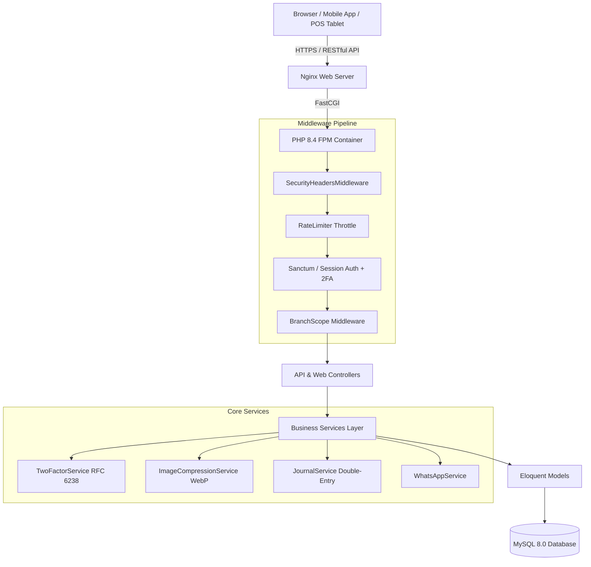

# System Architecture & Technical Specifications
# Istana Laundry Management System

> **Official Contact / Customer Care:** +62 811-5599-199  
> **API Swagger Documentation:** https://istanasystem.alk-tech.my.id/api/documentation  

---

## 1. High-Level Architecture Diagram

---

## 2. Security Architecture Specs

### 2.1 Two-Factor Authentication (TOTP RFC 6238)
- **Algorithm**: HMAC-SHA1 dengan time-step 30 detik.
- **Key Generation**: 16-character Base32 random secret terenkripsi AES-256-GCM pada database (`two_factor_secret`).
- **Recovery Codes**: 8 kode acak 10-karakter terenkripsi JSON.
- **Trusted Devices**: Perangkat dipercaya disimpan pada tabel `user_trusted_devices` dengan token `SHA-256` dan cookie HTTP-Only `2fa_device_trust` (Masa berlaku 30 hari).

### 2.2 Image Compression & WebP Pipeline
- **Target File Size**: Maksimal 200KB.
- **Processing Engine**: PHP GD Library dengan fallback otomatis (WebP → JPEG).
- **Optimization Flow**: Read Image → Re-orientate EXIF → Resize max 800x800px → Dynamic Quality Loop (Quality 85% - 40%) → Save WebP format.

### 2.3 Rate Limiting Standards
- **Public API**: 30 requests / min.
- **Authenticated API**: 120 requests / min.
- **Login Endpoint**: Max 10 attempts / min per IP.
- **2FA Challenge**: Max 6 attempts / min per session.
- **Brute Force Account Lockout**: Lockout akun selama 15 menit jika 5 kali berturut-turut kesalahan password.

---

## 3. Database & Multi-Tenancy Design

- **Branch Scoping**: Attribute `branch_id` dipasang di 90% entitas tabel. Trait `BranchScoped` menyuntikkan global scope `WHERE branch_id = session('scoped_branch_id')` secara otomatis.
- **Double-Entry Accounting**: Setiap transaksi kasir/pembayaran membuat entitas `journals` dan `journal_lines` dengan total Debit = Kredit.
